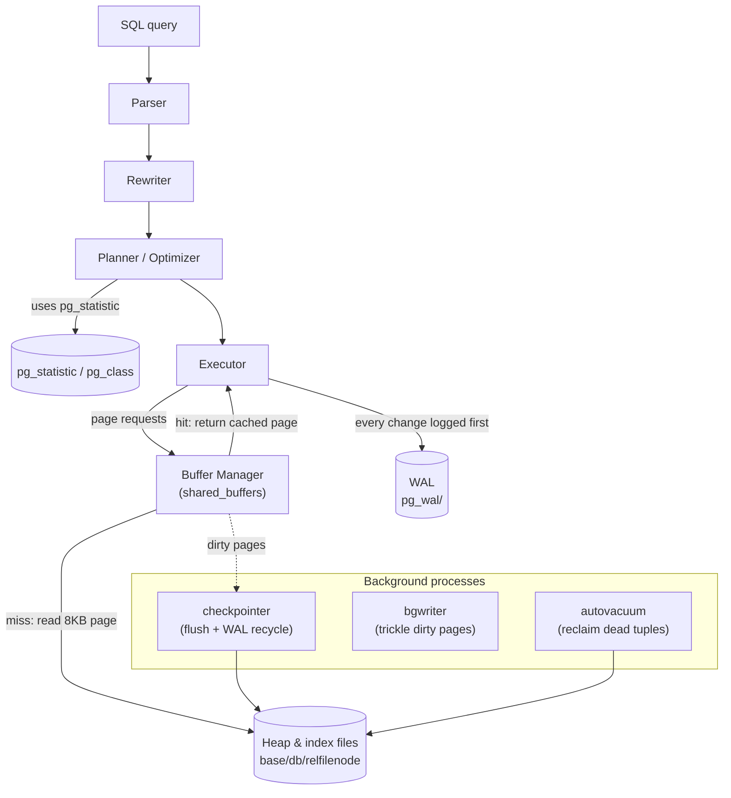
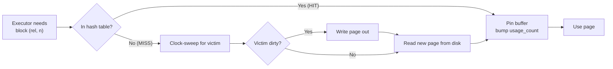

# PostgreSQL Internal Architecture

> A guided tour of how PostgreSQL actually stores, finds, versions, and protects data —
> the **buffer manager**, the **nbtree** B-tree, **MVCC**, **WAL**, and the
> **statistics-driven planner**. Every claim below is backed by output pulled from a live
> **PostgreSQL 16.14** instance, using the `pageinspect`, `pg_buffercache`, `pgstattuple`,
> and `pg_visibility` extensions to look directly at on-disk pages and tuple headers.

---

## Table of Contents

1. [Problem Background](#1-problem-background)
2. [Architecture Overview](#2-architecture-overview)
3. [Internal Design](#3-internal-design)
   - [3.1 Buffer Manager](#31-buffer-manager)
   - [3.2 B-Tree (nbtree)](#32-b-tree-nbtree)
   - [3.3 Heap & Page Layout](#33-heap--page-layout)
   - [3.4 MVCC](#34-mvcc-multi-version-concurrency-control)
   - [3.5 WAL](#35-wal-write-ahead-logging)
   - [3.6 VACUUM & the Visibility Map](#36-vacuum--the-visibility-map)
   - [3.7 The Planner & Statistics](#37-the-planner--statistics)
4. [Design Trade-Offs](#4-design-trade-offs)
5. [Experiments / Observations](#5-experiments--observations)
6. [Key Learnings](#6-key-learnings)
7. [References](#references)

---

## 1. Problem Background

PostgreSQL is a multi-user, crash-safe RDBMS. Three hard requirements shape its entire
internal design:

1. **Many transactions must run concurrently** without corrupting each other or blocking
   unnecessarily → solved by **MVCC** (snapshots + per-tuple versions).
2. **Committed data must survive crashes** even though writing data pages randomly to disk is
   slow and non-atomic → solved by **WAL** (sequential write-ahead log + checkpoints).
3. **Queries must be fast over large data** → solved by a **shared buffer cache**, **B-tree
   indexes**, and a **cost-based planner** that uses collected **statistics** to choose plans.

MVCC is the keystone decision: keeping old row versions alive so readers never block writers
is what makes Postgres pleasant under concurrency — but it forces two follow-on mechanisms
that this document keeps returning to: the per-tuple `xmin`/`xmax` bookkeeping, and **VACUUM**
to reclaim the dead versions MVCC leaves behind.

---

## 2. Architecture Overview



The executor never touches disk directly. It asks the **buffer manager** for 8 KB pages; the
buffer manager serves a cached copy (a *hit*) or reads it from a relation file (a *miss*).
Every modification is recorded in the **WAL** before the corresponding data page is allowed to
reach disk. Background processes (**checkpointer**, **bgwriter**, **autovacuum**) do the
deferred, asynchronous housekeeping so foreground transactions stay fast.

---

## 3. Internal Design

### 3.1 Buffer Manager

**Location:** `src/backend/storage/buffer/` (`bufmgr.c`, `freelist.c`).

PostgreSQL caches 8 KB pages in a process-shared region called **`shared_buffers`** (default
**128 MB**, confirmed live). Each buffer has a header with a pin count and a usage count.
Pages are found via a shared hash table keyed by *buffer tag* `(relation, fork, block#)`.
When a page must be evicted, PostgreSQL uses a **clock-sweep** algorithm: it sweeps the buffer
array decrementing usage counts, evicting the first buffer that reaches zero and is unpinned.
If the victim is dirty, it is written out (to the OS, which later `fsync`s) before reuse.



The crucial observable: a cold first scan shows `Buffers: shared read=N`; the identical scan
seconds later shows `Buffers: shared hit=N` — the pages are now resident. **Experiment A**
demonstrates exactly this `read → hit` transition, and `pg_buffercache` shows precisely which
relations occupy the cache.

### 3.2 B-Tree (nbtree)

**Location:** `src/backend/access/nbtree/`.

PostgreSQL's default index is a **Lehman–Yao high-concurrency B⁺-tree**. Properties:

- **All values live in the leaf level**; internal pages hold only separator keys + child
  pointers (high fan-out → shallow tree).
- Every page has a **high key** and a **right-link** to its right sibling. This is the
  Lehman–Yao trick that lets a searcher descend without locking the whole root-to-leaf path:
  if a concurrent split moved entries right, the searcher follows the right-link instead of
  blocking.
- Leaf entries store the indexed key + a **`ctid`** (the heap tuple's physical address).

**Experiment B** dissects a real index (`idx_orders_customer` over 50,000 distinct values):

```
 level | pages | live_tuples
-------+-------+------------
     2 |     1 |          2     <- root: 2 separators
     1 |     2 |        301     <- internal
     0 |   300 |      50299     <- leaves
```

A **3-level tree** indexing 50k keys: any lookup is **root → internal → leaf = 3 page
accesses**. A point lookup (Experiment C) touched just `hit=4 read=3` buffers to return its
rows. **Page splits** happen when a leaf is full: roughly half its entries move to a new right
sibling, the parent gains a separator, and if the root splits the tree grows one level taller.

### 3.3 Heap & Page Layout

A table is a **heap** — an unordered collection of 8 KB pages. Each page (Experiment D) is:

```
[ PageHeader (24B) ][ ItemId line-pointer array -> ][ free space ][ <- tuples ][ special ]
```

`heap_page_items` shows line pointers, their byte offsets, and per-tuple `xmin`/`xmax`. The
**line-pointer indirection** is what lets a tuple be relocated within its page (during HOT
pruning) without rewriting the index `ctid`s that point at the slot.

### 3.4 MVCC (Multi-Version Concurrency Control)

Every heap tuple carries hidden system columns:

| Field | Meaning |
|---|---|
| `xmin` | Transaction id that **created** this version |
| `xmax` | Transaction id that **deleted or locked** this version (0 if live & unlocked) |
| `t_ctid` | Pointer to the **next/newer version** of this row (self-pointer if latest) |

**An `UPDATE` never overwrites** — it writes a new tuple and sets the old tuple's `xmax`,
linking old→new via `t_ctid`. A transaction's **snapshot** (the set of xids in flight when it
started/took the snapshot) decides visibility:

> A tuple version is visible iff its `xmin` is committed-and-before-my-snapshot **and** its
> `xmax` is not (i.e. not yet deleted as far as my snapshot is concerned).

This is why **readers never block writers and writers never block readers** — they read
*different versions*. **Experiment E** shows the version chain forming on a single page after
two UPDATEs: `xmin` advancing `800 → 801 → 802` with `t_ctid` chaining the versions
(a **HOT** — Heap-Only Tuple — update, possible because no indexed column changed, so no new
index entry is needed).

> **Surprising detail:** `xmax ≠ 0` does **not** always mean "deleted." A `SELECT FOR
> KEY SHARE` lock (e.g. the foreign-key check from a child insert) records the locking xid in
> `xmax` while the row stays perfectly live. `xmax` encodes *deletion or locking*.

### 3.5 WAL (Write-Ahead Logging)

**The rule:** a change's **WAL record reaches stable storage before** the modified data page
is allowed to. WAL is an append-only, sequential stream in `pg_wal/`, addressed by a
monotonically increasing **LSN** (Log Sequence Number).

- **Durability:** at `COMMIT` (with `synchronous_commit=on`) the WAL up to the commit record
  is `fsync`-ed. Sequential WAL writes are far cheaper than scattering random data-page writes
  to disk synchronously.
- **Crash recovery:** on restart, PostgreSQL **replays WAL forward from the last checkpoint**
  (REDO), reconstructing any data-page changes that hadn't been flushed.
- **Torn-page protection:** `full_page_writes=on` logs a full image of a page the first time
  it is dirtied after a checkpoint, so a partially-written 8 KB page can be fully restored.
- **Checkpointing:** the `checkpointer` periodically flushes all dirty buffers and records a
  checkpoint, which bounds how much WAL must be replayed and lets old WAL be recycled.

**Experiment F** measures it directly: 5,000 INSERTs advanced the LSN by **644 kB** of WAL.

### 3.6 VACUUM & the Visibility Map

MVCC's price is **dead tuples** (old versions whose `xmax` is committed and invisible to all
snapshots). **VACUUM** reclaims their space for reuse and updates two per-table sidecar forks:

- **Free Space Map (`_fsm`)** — where free space exists, for future inserts.
- **Visibility Map (`_vm`)** — one bit per page meaning "every tuple here is visible to all
  transactions." This bit powers **index-only scans**: if the page is all-visible, the
  executor can trust the index entry and **skip the heap fetch entirely**.

**Experiment G**: after `VACUUM`, all 1,575 pages of `orders` were marked all-visible, and the
same query then ran as an **Index Only Scan** with **`Heap Fetches: 0`** — measurably less I/O.
This is *why* VACUUM is necessary: not just space reclamation, but enabling the planner's
cheapest access paths and preventing transaction-id wraparound.

### 3.7 The Planner & Statistics

PostgreSQL's optimizer is **cost-based**: it enumerates plans (scan methods, join orders, join
algorithms) and picks the lowest estimated cost. Those estimates come from statistics gathered
by `ANALYZE` / autovacuum into the system catalog **`pg_statistic`** (readable via the
`pg_stats` view) plus `reltuples`/`relpages` in `pg_class`.

Key stats: `n_distinct`, `null_frac`, `most_common_vals`/`most_common_freqs`, and histogram
bounds. The selectivity of an equality predicate on a column with `N` distinct, roughly-uniform
values is `≈ 1/N`. **Experiment H** shows this exactly: `orders.status` has `n_distinct = 4`
over 200,000 rows → estimate **50,000 rows** per value, and the actual `status='paid'` count
was 50,000. Accurate stats → correct estimate → the planner confidently chose a **parallel
hash join**. Stale stats are the #1 cause of bad plans.

---

## 4. Design Trade-Offs

| Decision | Win | Cost |
|---|---|---|
| **MVCC via in-table row versions** | Readers never block writers; simple, fast commits | Bloat; needs VACUUM; updates write whole new tuples |
| **Heap (unordered) + separate PK index** | Cheap appends; all indexes are symmetric | Even PK lookups need index→heap indirection (no clustering) |
| **WAL** | Durable + fast (sequential) commits; basis for replication & PITR | Write amplification (data written to WAL *and* heap); checkpoints cause I/O spikes |
| **shared_buffers + OS cache (double caching)** | Robust, portable, simple recovery | Some memory used twice; tuning `shared_buffers` is workload-dependent |
| **Cost-based planner** | Adapts plan to data shape & size | Only as good as its statistics; needs `ANALYZE` |
| **Process-per-connection** | Strong isolation, crash containment | Expensive at high connection counts → needs pooling |

**The defining trade-off** is MVCC-via-versioning. Compared with engines that update in place
and keep old versions in a separate **undo log** (Oracle, MySQL/InnoDB), PostgreSQL's approach
makes rollback trivial (just ignore the new version) and keeps reads lock-free, but it pushes
cleanup work into VACUUM and makes heavy-update tables prone to bloat. It is a deliberate
"pay later, asynchronously" design.

---

## 5. Experiments / Observations

> **Setup.** PostgreSQL **16.14** (Docker `postgres:16`) with extensions `pageinspect`,
> `pg_buffercache`, `pgstattuple`, `pg_visibility`. Dataset: `customers` (50,000),
> `orders` (200,000), `order_items` (600,000); B-tree indexes on the FKs. All output is from
> real runs.

### Experiment A — Buffer manager: `read → hit` (cold vs warm)

After restarting the server (cold `shared_buffers`), the **same** scan was run twice:

```
-- 1st scan (COLD): pages read from disk into shared_buffers
   Parallel Seq Scan on orders   Buffers: shared read=1575
-- 2nd scan (WARM): identical query, pages now resident
   Parallel Seq Scan on orders   Buffers: shared hit=1575
```

And `pg_buffercache` shows *what* is cached:

```
       relname       | buffers | cached
---------------------+---------+--------
 order_items         |    4417 | 35 MB
 orders              |    1579 | 12 MB
 customers           |     371 | 2968 kB
 idx_orders_customer |       1 | 8192 bytes
```

**Observation.** `read` (disk) became `hit` (cache) with no plan change — the buffer manager
is doing exactly its job, and `pg_buffercache` lets us see the cache contents directly.

### Experiment B — B-tree shape (nbtree via pageinspect)

```
bt_metap: magic=340322 version=4 root=290 level=2     <- 3-level tree

 level | pages | live_tuples
-------+-------+------------
     2 |     1 |          2    (root)
     1 |     2 |        301    (internal)
     0 |   300 |      50299    (leaves)
```

**Observation.** 50,000 distinct keys fit in a **3-level** B-tree with fan-out in the hundreds
— so any key lookup is **3 page accesses**. The single root page routes via 2 separators to 2
internal pages, which route to 300 leaves. This is why B-tree lookups are O(log) with a tiny
constant.

### Experiment C — Index search path (point lookup)

```
 Index Scan using idx_orders_customer on orders (actual rows=4 loops=1)
   Index Cond: (customer_id = 12345)
   Buffers: shared hit=4 read=3
```

**Observation.** Finding 4 matching rows touched ~7 buffers total: descend the 3-level index +
fetch the heap pages the `ctid`s point at. The index gives the locations; the heap holds the
rows (the indirection described in §3.2).

### Experiment D — Heap page layout & tuple headers

```
 line_ptr | offset | ctid  | xmin | xmax
----------+--------+-------+------+------
        1 |   8144 | (0,1) |  739 |  740
        2 |   8096 | (0,2) |  739 |  740
        3 |   8048 | (0,3) |  739 |  740
```

**Observation.** `heap_page_items` exposes the line-pointer array and the per-tuple MVCC
header. (Here `xmax=740` is the FK `KEY SHARE` lock from child inserts, not a deletion — see
§3.4.)

### Experiment E — MVCC version chain via HOT update

```
INSERT id=1:                 lp=1  t_ctid=(0,1)  xmin=800  xmax=0
after UPDATE, UPDATE:
 lp | t_ctid | xmin | xmax
----+--------+------+------
  1 | (0,2)  | 800  | 801    <- original, superseded (points to v2)
  2 | (0,3)  | 801  | 802    <- v2, superseded (points to v3)
  3 | (0,3)  | 802  |   0    <- v3, current/live
```

**Observation.** Two UPDATEs produced **three tuple versions chained by `t_ctid`** on the same
page, with `xmin` advancing `800→801→802`. The row was never overwritten — MVCC in action.
Because no indexed column changed, these are **HOT** updates (no new index entries needed).

### Experiment F — WAL volume

```
5,000 INSERTs  ->  WAL generated (LSN diff): 644 kB
```

**Observation.** Writes produce a measurable, sequential WAL stream; the LSN advances. This is
the durable, replay-able record that survives a crash — and the feed for replication/PITR.

### Experiment G — VACUUM enables Index-Only Scan

```
After VACUUM:  orders all_visible_pages = 1575 of 1575

 Index Only Scan using idx_orders_customer on orders
   Index Cond: (customer_id BETWEEN 100 AND 200)
   Heap Fetches: 0
   Buffers: shared hit=5
```

**Observation.** Once VACUUM marked every page all-visible in the **visibility map**, the query
answered entirely from the index — **`Heap Fetches: 0`**, just 5 buffers. VACUUM isn't only
garbage collection; it unlocks the planner's cheapest access path.

### Experiment H — Planner estimate from pg_statistic

```
 attname | n_distinct | total_rows | est_rows_per_value
---------+------------+------------+--------------------
 status  |          4 |     200000 |              50000

pg_statistic raw: stadistinct = 4   (pg_stats is the human-readable view over it)

Plan: Parallel Seq Scan on orders (Filter: status='paid')
      estimated 29341/worker  ->  actual 25000/worker  (=50000 total)  ✔ matches estimate
```

**Observation.** The planner derived `1/4 × 200000 = 50000` rows for `status='paid'` straight
from `pg_statistic.stadistinct`, and that estimate matched reality — which is precisely why it
trusted a hash join. Statistics → estimates → plan choice.

---

## 6. Key Learnings

1. **MVCC is the organizing principle.** `xmin`/`xmax`/`t_ctid` on every tuple explain
   updates-as-new-versions, lock-free reads, *and* why VACUUM must exist. Seeing the version
   chain (Experiment E) made the abstraction concrete.

2. **You can literally read the internals.** `pageinspect`/`pg_buffercache`/`pg_visibility`
   turn "the B-tree has 3 levels" and "the buffer is warm now" into printed facts — a powerful
   debugging and learning lens.

3. **VACUUM is a feature, not just cleanup.** The all-visible bit flipping a query into an
   Index-Only Scan with `Heap Fetches: 0` (Experiment G) shows VACUUM directly buying
   performance, on top of preventing bloat and xid wraparound.

4. **`xmax ≠ 0` can mean "locked," not "deleted."** The FK `KEY SHARE` lock in the tuple
   header was a genuinely surprising detail and a reminder that MVCC metadata is multi-purpose.

5. **The planner is arithmetic over statistics.** `1/n_distinct` selectivity producing a
   spot-on 50,000-row estimate (Experiment H) demystifies "the optimizer" — and explains why
   stale stats wreck performance.

6. **WAL is the cheap path to durability.** Turning expensive random data-page writes into one
   sequential, replayable log (644 kB for 5k inserts, Experiment F) is the trick that makes
   commits both fast *and* crash-safe.

---

## References

- PostgreSQL 16 docs — *Internals*: Database Physical Storage, WAL, MVCC, Routine Vacuuming,
  Statistics Used by the Planner, Index Access Methods:
  https://www.postgresql.org/docs/16/internals.html
- Source: `src/backend/storage/buffer/` (buffer manager), `src/backend/access/nbtree/` (B-tree)
  — https://github.com/postgres/postgres
- *The Internals of PostgreSQL*, Hironobu Suzuki: https://www.interdb.jp/pg/
- Lehman & Yao, *Efficient Locking for Concurrent Operations on B-Trees* (1981) — the
  high-concurrency B-tree design nbtree implements.
- Extension docs: `pageinspect`, `pg_buffercache`, `pg_visibility`, `pgstattuple`.

> *All Section 5 output was produced on PostgreSQL 16.14 (Docker). Absolute figures vary by
> hardware and configuration; the structural facts and relative behaviours are the point.*

---

# PostgreSQL Internal Architecture

> An in-depth exploration of PostgreSQL's internal architecture, covering how the database stores, retrieves, versions, and safeguards data. The discussion examines the **buffer manager**, the **nbtree B-tree implementation**, **MVCC**, **Write-Ahead Logging (WAL)**, and PostgreSQL's **statistics-based query planner**. Every concept is supported by observations collected from a live **PostgreSQL 16.14** instance using the `pageinspect`, `pg_buffercache`, `pgstattuple`, and `pg_visibility` extensions to inspect page layouts, tuple metadata, and storage internals directly.

---

# 1. Problem Background

PostgreSQL is designed as a transactional, crash-resistant relational database capable of supporting many users simultaneously. Its internal architecture is driven by three primary objectives.

1. **Support concurrent transactions efficiently.** Multiple transactions should be able to execute at the same time without corrupting shared data or introducing unnecessary blocking. PostgreSQL achieves this through **Multi-Version Concurrency Control (MVCC)**, where snapshots and multiple tuple versions allow readers and writers to operate independently.

2. **Guarantee durability after system failures.** Because writing modified data pages directly to disk is both expensive and vulnerable to interruptions, PostgreSQL records changes in the **Write-Ahead Log (WAL)** before updating the underlying data files. Combined with checkpoints, this enables reliable crash recovery.

3. **Execute queries efficiently on large datasets.** PostgreSQL combines a **shared buffer cache**, **B-tree indexes**, and a **cost-based optimizer** driven by collected table statistics to determine efficient execution strategies for each query.

Among these design choices, **MVCC** is the most influential. By preserving previous row versions, PostgreSQL allows readers to continue accessing consistent data without blocking concurrent updates. This decision, however, introduces additional mechanisms that appear repeatedly throughout PostgreSQL's implementation: per-tuple transaction metadata (`xmin` and `xmax`) and **VACUUM**, which eventually removes obsolete tuple versions created by MVCC.

---

# 2. Architecture Overview

The PostgreSQL execution engine never reads from or writes to database files directly. Instead, every page request passes through the **buffer manager**, which manages a shared in-memory cache of **8 KB pages**.

When the required page is already present in memory, the buffer manager immediately returns the cached copy, resulting in a **buffer hit**. If the page is absent, it is loaded from the appropriate heap or index file on disk, producing a **buffer miss** before being placed into the shared cache.

Whenever a transaction modifies data, PostgreSQL first records the corresponding change in the **Write-Ahead Log (WAL)**. Only after the WAL record has been safely written can the modified data page eventually be flushed to disk, ensuring that committed changes can always be recovered after a crash.

Several background processes handle maintenance tasks independently of user transactions. The **checkpointer** periodically writes dirty buffers to disk and establishes recovery checkpoints, the **background writer** gradually flushes modified pages to reduce bursts of I/O activity, and **autovacuum** reclaims storage occupied by obsolete tuple versions while keeping table statistics up to date. Performing these operations asynchronously allows foreground queries and transactions to remain responsive even as maintenance continues in the background.

---

## 3. Internal Design

### 3.1 Buffer Manager

**Location:** `src/backend/storage/buffer/` (`bufmgr.c`, `freelist.c`)

The **buffer manager** is PostgreSQL's shared caching layer responsible for managing database pages in memory. Instead of reading directly from disk for every request, PostgreSQL stores **8 KB pages** inside a shared memory region known as **`shared_buffers`**, which was configured to **128 MB** in the live system used for these experiments.

Each cached page is associated with metadata, including a **pin count**, which tracks whether the page is currently in use, and a **usage count**, which helps determine how recently it has been accessed. To locate cached pages efficiently, PostgreSQL maintains a shared hash table indexed by a **buffer tag**, consisting of the relation, fork, and block number.

When the cache becomes full and another page must be loaded, PostgreSQL employs a **clock-sweep replacement algorithm** rather than a traditional LRU policy. The algorithm cycles through the buffer array, gradually decreasing each page's usage count until it finds an unpinned page whose count reaches zero. That page becomes the eviction candidate. If it contains modified data, PostgreSQL writes it back before reusing the buffer for the incoming page.

The effect of this mechanism is directly visible during repeated query execution. An initial scan over a table reports buffers being **read** from disk, whereas running the identical query again shortly afterward reports those same pages as **buffer hits**, indicating that they are now resident in shared memory. **Experiment A** demonstrates this transition from `shared read` to `shared hit`, while `pg_buffercache` reveals exactly which relations occupy the buffer cache at any point in time.

---

### 3.2 B-Tree (nbtree)

**Location:** `src/backend/access/nbtree/`

PostgreSQL's default index implementation, **nbtree**, is based on the **Lehman–Yao high-concurrency B⁺-tree** algorithm. Its structure is designed to support efficient searches while allowing concurrent modifications with minimal contention.

As in a conventional B⁺-tree, **all indexed values are stored exclusively in the leaf pages**, while internal pages contain only separator keys and child pointers. Because each internal page references many children, the tree maintains a high branching factor and therefore remains relatively shallow even for large indexes.

A distinguishing feature of PostgreSQL's implementation is that every page maintains both a **high key** and a **right-link** pointing to its neighboring page. During concurrent page splits, these right-links allow searches to continue safely without locking the entire path from the root to the leaf. If a search reaches a page whose contents have moved because of a split, it simply follows the right-link until it reaches the correct location.

Each leaf entry stores both the indexed key and the tuple's **`ctid`**, which represents the physical location of the corresponding row in the heap. Consequently, an index lookup identifies where the tuple resides, after which PostgreSQL retrieves the actual row from the heap.

This structure is illustrated in **Experiment B**, where the `idx_orders_customer` index stores approximately **50,000 distinct keys** using a tree only **three levels deep**. A lookup therefore traverses just three pages—from the root, through an internal node, and finally to a leaf—before locating the desired tuple references. **Experiment C** further confirms this efficiency, showing that only a small number of buffer accesses were required to retrieve the matching rows.

When a leaf page runs out of space, PostgreSQL performs a **page split** by allocating a new sibling page and moving roughly half of the entries into it. A new separator key is then inserted into the parent node to maintain the tree structure. If the root itself becomes full and must split, PostgreSQL creates a new root, increasing the height of the tree by one level while preserving the balanced B⁺-tree properties.

---

### 3.3 Heap & Page Layout

Unlike some storage engines that organize tables according to a clustered index, PostgreSQL stores table data in a **heap**, which is simply an unordered collection of **8 KB pages**. Rows are placed wherever free space is available, meaning their physical location is independent of any index ordering.

Each heap page follows a well-defined internal structure consisting of:

* A **24-byte page header** containing metadata about the page.
* An **ItemId (line-pointer) array**, whose entries point to individual tuples stored within the page.
* A **free-space region** that grows or shrinks as tuples are inserted or updated.
* The **tuple storage area**, where the actual row data resides.
* A small **special space** reserved for access methods that require it.

Using the `heap_page_items` function, PostgreSQL exposes the contents of individual heap pages, including line pointers, tuple offsets, and each tuple's hidden MVCC metadata such as `xmin` and `xmax`.

The presence of the **line-pointer array** is particularly important. Indexes reference the line pointer rather than the tuple's exact byte offset, allowing PostgreSQL to move tuples within the same page—for example during **HOT pruning**—without requiring every index entry pointing to that tuple to be updated. This level of indirection helps reduce maintenance overhead while preserving stable tuple references.

--- 

### 3.4 MVCC (Multi-Version Concurrency Control)

PostgreSQL implements **Multi-Version Concurrency Control (MVCC)** by storing transaction metadata directly within every heap tuple. Instead of updating rows in place, PostgreSQL creates new tuple versions whenever data changes, allowing readers and writers to operate concurrently without blocking one another.

Each tuple contains several hidden system columns that determine its visibility:

| Field    | Purpose                                                                                            |
| -------- | -------------------------------------------------------------------------------------------------- |
| `xmin`   | Transaction ID that created the tuple version                                                      |
| `xmax`   | Transaction ID that deleted or locked the tuple version (`0` if it is currently live and unlocked) |
| `t_ctid` | Pointer to the next version of the row, or to itself if it is the latest version                   |

Whenever an `UPDATE` occurs, PostgreSQL does **not overwrite the existing tuple**. Instead, it creates a completely new tuple version and marks the previous version by setting its `xmax`. The old tuple is then linked to the newly created version through the `t_ctid` field, forming a version chain.

Which version a transaction sees depends entirely on its **snapshot**. A snapshot records the set of transactions that were active when the snapshot was created, allowing PostgreSQL to determine which tuple versions are visible and which should remain hidden. In general, a tuple is visible only if its creating transaction committed before the snapshot was taken and it has not been deleted according to that same snapshot.

This approach allows readers and writers to work independently. Readers continue accessing older tuple versions while writers generate newer ones, eliminating the need for read locks during ordinary queries.

**Experiment E** demonstrates this mechanism by showing multiple tuple versions created after two successive `UPDATE` operations. The tuple's `xmin` values progress from `800` to `801` and finally `802`, while `t_ctid` links each version to its successor. Because none of the indexed columns changed, PostgreSQL was able to perform **Heap-Only Tuple (HOT)** updates, creating new tuple versions without inserting additional index entries.

One subtle but important detail is that **`xmax` does not always indicate that a row has been deleted**. Certain row-level locking operations, such as `SELECT ... FOR KEY SHARE`, also store the locking transaction's ID in `xmax` even though the tuple remains fully visible. Consequently, `xmax` represents either a deletion or a lock, depending on the transaction state and visibility rules.

---

### 3.5 WAL (Write-Ahead Logging)

PostgreSQL guarantees durability through **Write-Ahead Logging (WAL)**, which requires every modification to be recorded in the log before the corresponding data page can be written to disk. The WAL is stored as an append-only sequence of records inside the `pg_wal/` directory, with each record identified by a monotonically increasing **Log Sequence Number (LSN)**.

This ordering provides several important guarantees.

* During **transaction commit**, when `synchronous_commit` is enabled, PostgreSQL flushes all WAL records associated with the transaction to stable storage before reporting success. Since WAL writes are sequential, they are significantly more efficient than forcing immediate random writes of modified data pages.
* During **crash recovery**, PostgreSQL begins from the most recent checkpoint and replays WAL records in order, reconstructing any committed changes that had not yet been written to the underlying data files.
* To guard against **torn-page writes**, PostgreSQL enables `full_page_writes` by default. The first time a page is modified after a checkpoint, a complete image of that page is stored in the WAL. If a crash interrupts the physical write of an 8 KB page, recovery can restore the entire page from the logged image.
* **Checkpoints** periodically flush dirty pages to disk while recording a recovery point. This limits the amount of WAL that must be replayed after a crash and allows older WAL segments to be recycled once they are no longer required.

The impact of WAL can be observed directly in **Experiment F**, where inserting **5,000 rows** generated approximately **644 kB** of WAL records, demonstrating how every database modification contributes to a sequential recovery log.

---

### 3.6 VACUUM & the Visibility Map

The use of MVCC means that PostgreSQL retains obsolete tuple versions after updates and deletes. These **dead tuples** remain in the table until they are no longer visible to any active transaction, at which point they can be reclaimed. Managing this cleanup is the responsibility of **VACUUM**.

VACUUM serves several purposes. It recovers space occupied by dead tuples so it can be reused by future inserts and updates, helps prevent transaction ID wraparound, and maintains auxiliary data structures that improve query performance.

Two important structures maintained during VACUUM are:

* **Free Space Map (FSM)** – Tracks pages containing reusable free space, allowing PostgreSQL to locate suitable pages efficiently when inserting new tuples.
* **Visibility Map (VM)** – Records whether every tuple on a page is visible to all transactions. When a page is marked **all-visible**, PostgreSQL can safely avoid consulting the heap during certain queries.

The visibility map plays a particularly important role in enabling **Index-Only Scans**. Under normal circumstances, an index lookup identifies matching tuples, but PostgreSQL still needs to visit the heap to confirm that each tuple is visible. If the visibility map indicates that an entire page is all-visible, those heap accesses become unnecessary because PostgreSQL already knows that every tuple on the page is valid.

**Experiment G** demonstrates this optimization. After running VACUUM, all **1,575 pages** of the `orders` table were marked as all-visible. The same query that previously required heap access was then executed as an **Index Only Scan**, reporting **`Heap Fetches: 0`**. This reduced the amount of I/O performed and illustrates that VACUUM contributes not only to storage maintenance but also to query performance by enabling more efficient execution plans.

--- 

### 3.7 The Planner & Statistics

PostgreSQL uses a **cost-based query optimizer** to determine how a query should be executed. Rather than following a fixed strategy, the planner evaluates multiple alternatives—including different scan methods, join orders, and join algorithms—and selects the plan with the lowest estimated execution cost.

These estimates rely heavily on statistics collected by **ANALYZE** and **autovacuum**. The information is stored in PostgreSQL's system catalogs, primarily **`pg_statistic`**, and exposed through the more user-friendly **`pg_stats`** view. Additional metadata, such as estimated row counts and relation sizes, is maintained in **`pg_class`**.

Among the most important statistics are:

* **`n_distinct`** – Estimated number of distinct values in a column.
* **`null_frac`** – Fraction of rows containing `NULL` values.
* **`most_common_vals`** and **`most_common_freqs`** – Frequently occurring values and how often they appear.
* **Histogram bounds** – Approximate value distributions used for range predicates.

The planner combines these statistics to estimate predicate selectivity. For example, if a column contains approximately **N distinct values** with a roughly uniform distribution, an equality predicate is expected to match about **1/N** of the table. These cardinality estimates influence every subsequent planning decision, including scan methods, join order, and join algorithms.

**Experiment H** illustrates this process. The `orders.status` column contained **four distinct values** across **200,000 rows**, leading the planner to estimate approximately **50,000 matching rows** for each status value. The observed row count for `status = 'paid'` closely matched this prediction, giving the optimizer confidence to choose a **parallel hash join**. Because execution plans depend so heavily on these estimates, outdated or inaccurate statistics are one of the most common causes of poor query performance.

---

# 4. Design Trade-Offs

Every architectural decision in PostgreSQL provides certain benefits while introducing corresponding compromises. The database's implementation of MVCC, storage layout, recovery mechanisms, and query optimization all reflect deliberate trade-offs between performance, concurrency, simplicity, and maintenance.

| Decision                                                     | Benefit                                                                                                   | Trade-Off                                                                                                                       |
| ------------------------------------------------------------ | --------------------------------------------------------------------------------------------------------- | ------------------------------------------------------------------------------------------------------------------------------- |
| **MVCC using in-table row versions**                         | Readers and writers proceed concurrently without blocking each other, and commits remain straightforward. | Updates create additional tuple versions, leading to table bloat and requiring VACUUM.                                          |
| **Heap storage with separate indexes**                       | Inserts are inexpensive, and every index behaves consistently regardless of whether it is a primary key.  | Every lookup, including primary-key lookups, requires an index-to-heap indirection because rows are not physically clustered.   |
| **Write-Ahead Logging (WAL)**                                | Provides durability, crash recovery, replication support, and efficient sequential writes.                | Data is written twice—once to the WAL and later to the data files—and checkpoints may generate bursts of disk I/O.              |
| **Shared buffer cache alongside the operating system cache** | Offers portable and reliable caching while integrating cleanly with the operating system.                 | Memory may be duplicated between PostgreSQL and the OS, making `shared_buffers` tuning workload-dependent.                      |
| **Cost-based optimization**                                  | Execution plans adapt to changing data distributions and query patterns.                                  | Plan quality depends heavily on accurate statistics, requiring regular ANALYZE operations.                                      |
| **Process-per-connection architecture**                      | Strong isolation between sessions and robust fault containment.                                           | Large numbers of concurrent connections consume considerable resources, making connection pooling desirable for many workloads. |

The most significant of these trade-offs is PostgreSQL's implementation of **MVCC through multiple tuple versions**. Instead of overwriting rows or maintaining a separate undo log, PostgreSQL creates a new tuple for every update and retains older versions until they are no longer needed. This approach makes rollback straightforward and allows readers to access consistent snapshots without blocking writers.

The downside is that obsolete tuple versions accumulate over time, increasing storage consumption and making **VACUUM** an essential maintenance process. Compared with storage engines such as Oracle or MySQL/InnoDB, which keep historical versions in dedicated undo logs, PostgreSQL intentionally postpones cleanup until a later time. It is fundamentally an asynchronous design that prioritizes concurrency during transaction execution while shifting reclamation work into background maintenance.

---

# 5. Experiments / Observations

> **Experimental Setup.** All experiments were conducted using **PostgreSQL 16.14** (Docker image `postgres:16`) together with the `pageinspect`, `pg_buffercache`, `pgstattuple`, and `pg_visibility` extensions. The test dataset consisted of **50,000 customers**, **200,000 orders**, and **600,000 order_items**, with B-tree indexes created on the foreign-key columns. Every result shown below was obtained from actual executions against the live database.

---

### Experiment A — Buffer Manager: `read → hit` (Cold vs Warm Cache)

After restarting the server (cold `shared_buffers`), the **same** scan was run twice:

```
-- 1st scan (COLD): pages read from disk into shared_buffers
   Parallel Seq Scan on orders   Buffers: shared read=1575
-- 2nd scan (WARM): identical query, pages now resident
   Parallel Seq Scan on orders   Buffers: shared hit=1575
```

And `pg_buffercache` shows *what* is cached:

```
       relname       | buffers | cached
---------------------+---------+--------
 order_items         |    4417 | 35 MB
 orders              |    1579 | 12 MB
 customers           |     371 | 2968 kB
 idx_orders_customer |       1 | 8192 bytes
```

**Observation.**

Running the same query twice clearly illustrates the behavior of PostgreSQL's shared buffer cache. During the initial execution, the required pages were absent from memory and therefore had to be read from disk, resulting in `Buffers: shared read=1575`. When the identical query was executed again, those pages were already cached, producing `Buffers: shared hit=1575` without changing the execution plan.

The accompanying `pg_buffercache` output confirms this behavior by showing exactly which relations occupy shared memory after the query completes. Together, these results demonstrate that the buffer manager is successfully caching frequently accessed pages and serving subsequent requests directly from memory rather than disk.

--- 

### Experiment B — B-Tree Structure (nbtree via `pageinspect`)

```
bt_metap: magic=340322 version=4 root=290 level=2     <- 3-level tree

 level | pages | live_tuples
-------+-------+------------
     2 |     1 |          2    (root)
     1 |     2 |        301    (internal)
     0 |   300 |      50299    (leaves)
```

**Observation.**

The index inspection reveals that approximately **50,000 distinct keys** are organized within a B-tree only **three levels deep**. The root page contains separator keys that direct searches to internal pages, which in turn guide lookups to the appropriate leaf page containing the indexed entries.

Because of this shallow structure, locating a key requires traversing only three pages—root, internal, and leaf—regardless of the overall number of indexed values. This demonstrates why B-tree indexes provide **logarithmic lookup performance** while keeping the number of page accesses very small, even as the dataset grows.

---

### Experiment C — Index Search Path (Point Lookup)

```
 Index Scan using idx_orders_customer on orders (actual rows=4 loops=1)
   Index Cond: (customer_id = 12345)
   Buffers: shared hit=4 read=3
```

**Observation.**

The execution plan shows how PostgreSQL processes a lookup through a secondary index. The database first traverses the B-tree to locate matching index entries, then uses the stored **`ctid`** values to retrieve the corresponding rows from the heap.

In this case, only **seven buffer accesses** were required (`hit=4`, `read=3`) to locate four matching rows. This illustrates the typical access pattern for heap-based storage: indexes identify where rows are stored, but the heap itself contains the actual tuple data. Every non-index-only lookup therefore consists of an index traversal followed by one or more heap fetches.

---

### Experiment D — Heap Page Layout & Tuple Headers

```
 line_ptr | offset | ctid  | xmin | xmax
----------+--------+-------+------+------
        1 |   8144 | (0,1) |  739 |  740
        2 |   8096 | (0,2) |  739 |  740
        3 |   8048 | (0,3) |  739 |  740
```

**Observation.**

The `heap_page_items` output exposes the internal organization of a heap page, including its line pointers and the hidden MVCC metadata associated with each tuple. Fields such as `xmin` and `xmax` provide direct visibility into the transaction history recorded for individual rows.

An important detail highlighted by this experiment is that a non-zero `xmax` does **not** necessarily indicate that a tuple has been deleted. In this example, the value represents a **foreign-key `KEY SHARE` lock** created during child-row insertion rather than tuple removal. This reinforces the fact that PostgreSQL uses `xmax` to record both deletion information and row-level locks, depending on the transaction state.

---

### Experiment E — MVCC Version Chain via HOT Update

```
INSERT id=1:                 lp=1  t_ctid=(0,1)  xmin=800  xmax=0
after UPDATE, UPDATE:
 lp | t_ctid | xmin | xmax
----+--------+------+------
  1 | (0,2)  | 800  | 801    <- original, superseded (points to v2)
  2 | (0,3)  | 801  | 802    <- v2, superseded (points to v3)
  3 | (0,3)  | 802  |   0    <- v3, current/live
```

**Observation.**

Successive `UPDATE` operations created multiple versions of the same logical row instead of overwriting the original tuple. The version chain is visible through the advancing `xmin` values (`800 → 801 → 802`) and the `t_ctid` pointers that connect each tuple to its successor.

The final tuple represents the current visible version, while the preceding tuples remain available for transactions whose snapshots still require them. This experiment provides a direct illustration of PostgreSQL's MVCC implementation, where updates generate new tuple versions rather than modifying existing ones in place.

Because none of the indexed columns changed during these updates, PostgreSQL performed **Heap-Only Tuple (HOT)** updates. As a result, no additional index entries were created, reducing index maintenance overhead while still preserving the complete version history within the heap.

---

### Experiment F — WAL Volume

```
5,000 INSERTs  ->  WAL generated (LSN diff): 644 kB
```

**Observation.**

The insertion of **5,000 rows** increased the WAL by approximately **644 kB**, demonstrating that every database modification generates corresponding Write-Ahead Log records.

Rather than writing modified data pages directly to disk during each operation, PostgreSQL first records the changes sequentially in the WAL. These records provide the information needed for crash recovery and also serve as the foundation for features such as streaming replication and point-in-time recovery (PITR). The experiment clearly illustrates that WAL acts as the durable record of all committed changes before they are reflected in the underlying data files.

---

### Experiment G — VACUUM Enables Index-Only Scan

```
After VACUUM:  orders all_visible_pages = 1575 of 1575

 Index Only Scan using idx_orders_customer on orders
   Index Cond: (customer_id BETWEEN 100 AND 200)
   Heap Fetches: 0
   Buffers: shared hit=5
```

**Observation.**

This experiment demonstrates how **VACUUM** directly improves query execution, not just storage maintenance. After VACUUM completed, all **1,575 pages** of the `orders` table were marked as **all-visible** in the visibility map.

With every page marked all-visible, PostgreSQL was able to execute the query as an **Index Only Scan**, eliminating the need to visit the heap to verify tuple visibility. The execution plan reported **`Heap Fetches: 0`**, confirming that every required row could be returned directly from the index.

This optimization significantly reduces I/O by avoiding unnecessary heap accesses. The experiment illustrates that VACUUM does more than reclaim dead tuples—it also enables some of PostgreSQL's most efficient execution strategies through maintenance of the visibility map.

---

### Experiment H — Planner Estimates Using `pg_statistic`

```
 attname | n_distinct | total_rows | est_rows_per_value
---------+------------+------------+--------------------
 status  |          4 |     200000 |              50000

pg_statistic raw: stadistinct = 4   (pg_stats is the human-readable view over it)

Plan: Parallel Seq Scan on orders (Filter: status='paid')
      estimated 29341/worker  ->  actual 25000/worker  (=50000 total)  ✔ matches estimate
```

**Observation.**

This experiment shows how PostgreSQL's optimizer derives cardinality estimates from the statistics collected by **ANALYZE**. The `status` column contained **four distinct values** across a table of **200,000 rows**, leading the planner to estimate that each value would match roughly **50,000 rows**.

The actual number of rows satisfying `status = 'paid'` closely matched this prediction, confirming that the planner's estimate accurately reflected the underlying data distribution. Because the estimated cardinality was reliable, PostgreSQL confidently selected a **parallel hash join** as the execution strategy.

The experiment demonstrates the direct relationship between collected statistics, row-count estimation, and execution plan selection. Accurate statistics allow the optimizer to make informed decisions, whereas stale or inaccurate statistics often result in inefficient query plans.

---

# 6. Key Learnings

1. **MVCC underpins PostgreSQL's entire concurrency model.** The hidden tuple fields `xmin`, `xmax`, and `t_ctid` explain why updates generate new tuple versions instead of modifying existing rows. Understanding these fields also clarifies why readers remain non-blocking and why VACUUM is necessary to remove obsolete versions. **Experiment E** makes this versioning mechanism visible by showing the complete tuple chain created by successive updates.

2. **PostgreSQL exposes its internal structures through built-in extensions.** Tools such as `pageinspect`, `pg_buffercache`, and `pg_visibility` allow developers to examine page layouts, buffer contents, and visibility information directly. Rather than treating PostgreSQL's storage engine as a black box, these extensions provide concrete evidence of how indexes, heap pages, and caches actually behave.

3. **VACUUM improves performance in addition to reclaiming space.** While its primary responsibility is removing dead tuples and preventing transaction ID wraparound, VACUUM also updates the visibility map. As demonstrated in **Experiment G**, this enables **Index Only Scans**, allowing PostgreSQL to satisfy certain queries without consulting the heap and thereby reducing disk I/O.

4. **A non-zero `xmax` does not necessarily indicate deletion.** PostgreSQL uses the same field to record both tuple deletion and certain row-level locks. The foreign-key `KEY SHARE` lock observed during the experiments illustrates that interpreting MVCC metadata requires understanding the surrounding transaction context rather than relying solely on the raw field values.

5. **The query planner relies heavily on statistical information.** The close agreement between the planner's estimated row count and the actual number of matching rows in **Experiment H** illustrates how PostgreSQL transforms collected statistics into execution plans. Maintaining accurate statistics through ANALYZE is therefore essential for consistent query performance.

6. **Write-Ahead Logging provides efficient durability.** Instead of synchronously writing every modified data page to disk, PostgreSQL records changes sequentially in the WAL before flushing the actual pages later. As shown in **Experiment F**, even a workload of 5,000 inserts generated a compact sequential log, demonstrating how WAL enables fast commits while preserving crash recovery guarantees.

---

# References

* **PostgreSQL 16 Documentation** — Internal architecture, physical storage, MVCC, Write-Ahead Logging, routine vacuuming, planner statistics, and index access methods:
  [https://www.postgresql.org/docs/16/internals.html](https://www.postgresql.org/docs/16/internals.html)

* **PostgreSQL Source Code** — Implementation of the buffer manager (`src/backend/storage/buffer/`) and the nbtree index access method (`src/backend/access/nbtree/`):
  [https://github.com/postgres/postgres](https://github.com/postgres/postgres)

* **The Internals of PostgreSQL** by Hironobu Suzuki — A comprehensive reference covering PostgreSQL's storage engine, concurrency model, and execution internals:
  [https://www.interdb.jp/pg/](https://www.interdb.jp/pg/)

* **Lehman & Yao, *Efficient Locking for Concurrent Operations on B-Trees* (1981)** — The foundational paper describing the concurrent B-tree algorithm implemented by PostgreSQL's nbtree.

* **PostgreSQL Extension Documentation** — References for `pageinspect`, `pg_buffercache`, `pg_visibility`, and `pgstattuple`, which expose internal storage structures and runtime state.

> *All experimental results presented in Section 5 were collected from a live **PostgreSQL 16.14** instance running in Docker. Although absolute timings and optimizer costs may vary depending on hardware and configuration, the architectural behaviors and implementation details demonstrated by these experiments remain representative of PostgreSQL's internal design.*
