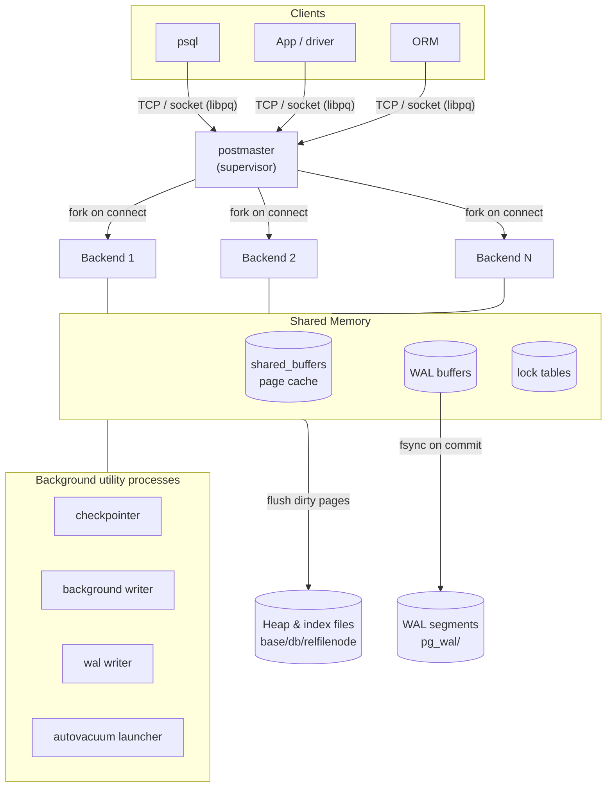
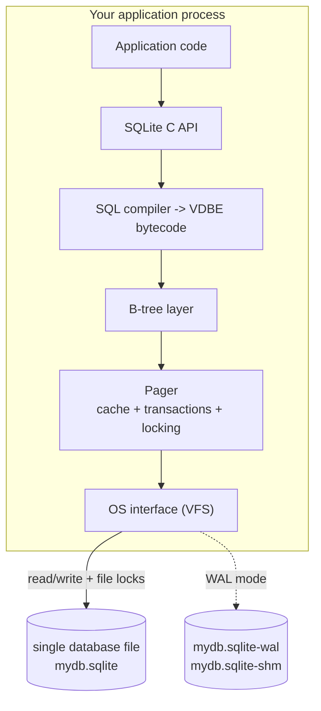
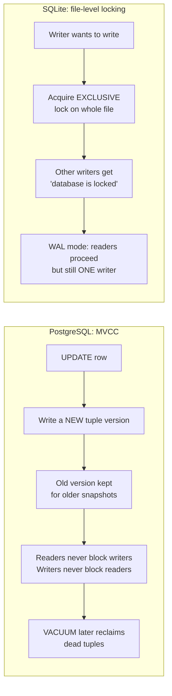

# PostgreSQL vs SQLite — An Architectural Comparison

> An exploration of two relational database systems that represent very different architectural philosophies:
> **PostgreSQL** is a client-server database engine intended for highly concurrent, multi-user environments, while **SQLite** is an embedded database library designed to run directly within an application's process. Throughout this document, each architectural choice is connected to its practical impact, with the **Experiments** section demonstrating these behaviors using PostgreSQL 16.14 (Docker) and SQLite 3.40.1 through Python's built-in `sqlite3` module.

---

## 1. Problem Background

Although PostgreSQL and SQLite both implement the relational model and support SQL, they were created to address fundamentally different deployment models. The primary distinction is not the language they use, but **where and how the database executes**.

### Why PostgreSQL was created

PostgreSQL originated from the POSTGRES research project led by Michael Stonebraker at UC Berkeley in 1986. The project expanded the traditional relational database model by introducing richer data types, extensibility, and advanced database capabilities. Its intended use case was a **shared, persistent database server** capable of serving many users simultaneously. Multiple clients connect over a network, execute transactions concurrently, and rely on the system to maintain consistency, survive failures, and support long-term schema evolution.

Meeting these requirements necessitates a dedicated server process. PostgreSQL continuously manages database files, coordinates concurrent access, enforces integrity constraints, and remains operational regardless of whether any clients are currently connected.

### Why SQLite was created

SQLite, developed by D. Richard Hipp in 2000, was designed for environments where running a dedicated database server would introduce unnecessary complexity. Originally developed for software running aboard a guided-missile destroyer, it targeted systems that needed reliable transactional storage without requiring database administration or an independent server process.

Instead of operating as a standalone service, SQLite is compiled directly into an application as a library. The database itself is simply a regular disk file accessed by the application. Its well-known statement—*"SQLite does not compete with client/server databases. SQLite competes with `fopen()`"*—perfectly summarizes its objective: replacing custom file formats with a lightweight SQL database rather than serving as a centralized database server.

### Summary

|                | Primary role                                       | Typical replacement                           |
| -------------- | -------------------------------------------------- | --------------------------------------------- |
| **PostgreSQL** | Shared client-server database for concurrent users | Oracle or another centralized database server |
| **SQLite**     | Embedded SQL storage engine within an application  | `fopen()` or custom application file formats  |

Nearly every architectural distinction discussed later—including process architecture, locking strategy, storage organization, and durability mechanisms—can be traced back to these contrasting design goals.

---

## 2. Architecture Overview

### 2.1 PostgreSQL — Client-Server Architecture with Dedicated Backend Processes



PostgreSQL follows a traditional **client-server** model. A central process, known as the **postmaster**, listens for incoming client connections. Whenever a new client connects, the postmaster creates a dedicated **backend process** to handle that session. Each client therefore communicates with its own backend rather than sharing a single execution thread.

Although backend processes operate independently, they coordinate through a common **shared-memory** region containing structures such as `shared_buffers`, WAL buffers, and lock tables. A collection of **background utility processes**—including the checkpointer, background writer, WAL writer, and autovacuum launcher—perform maintenance tasks that keep the database consistent and efficient. As a result, PostgreSQL behaves as a continuously running database service that exists independently of any particular client connection.

> Live verification (see Experiment 5) confirmed that a newly started PostgreSQL instance already contains processes such as `checkpointer`, `background writer`, `walwriter`, `autovacuum launcher`, and `logical replication launcher`, demonstrating that these services remain active even when no user sessions are connected.

---

### 2.2 SQLite — Embedded Database Library



SQLite adopts a completely different design philosophy. Rather than running as a separate server, it is compiled directly into an application as a lightweight library. Every database operation is executed within the application's own process, eliminating the need for an external service.

When a SQL statement is issued, SQLite parses and compiles it into instructions for its internal **Virtual Database Engine (VDBE)**. Those instructions operate on a B-tree storage layer, while the **pager** manages page caching, transactions, and locking. Communication with the operating system is handled through the **Virtual File System (VFS)** abstraction, which performs the actual file I/O.

Because SQLite lacks a central coordinating server, concurrent access from multiple applications is managed solely through **operating-system file locks**. This architectural choice is the primary reason SQLite allows only a single writer at any given time.

---

### 2.3 A Simple Way to Think About It

```
PostgreSQL = a database service that applications connect to.
SQLite     = a database library that applications call directly.
```

The distinction is straightforward: PostgreSQL runs as an independent service that clients communicate with over a network or local socket, whereas SQLite executes as part of the application itself. This single architectural difference explains many of the contrasting behaviors discussed throughout the remainder of this comparison.

--- 

## 3. Internal Design

### 3.1 Storage Layout

| Aspect                | PostgreSQL                                                                                                              | SQLite                                                                                                     |
| --------------------- | ----------------------------------------------------------------------------------------------------------------------- | ---------------------------------------------------------------------------------------------------------- |
| On-disk organization  | Stores each database as a **directory**, with **separate files for every relation** (tables, indexes, TOAST data, etc.) | Stores the **entire database in a single file**, containing all tables, indexes, and schema information    |
| Default page size     | **8 KB** (`block_size`)                                                                                                 | **4 KB** (`page_size`, configurable from 512 B to 64 KB)                                                   |
| Table organization    | Uses an unordered **heap**; the primary key is maintained as a separate B-tree index that points to heap tuples         | Stores tables as a **clustered B-tree** keyed by `rowid`, with records residing directly in the leaf pages |
| Large-value storage   | Uses **TOAST** to move oversized values into compressed overflow storage                                                | Stores oversized values in linked overflow pages                                                           |
| Free-space management | Tracks reusable space through the Free Space Map (`_fsm`) and Visibility Map (`_vm`)                                    | Maintains reusable pages through a freelist recorded in the database file                                  |

These characteristics were confirmed during the experiments. PostgreSQL reported a `block_size` of **8192 bytes** and stored the sample table (`orders`) and its index as separate files (`base/16384/16400` and `base/16384/16428`). SQLite, in contrast, reported a `page_size` of **4096 bytes** and stored everything inside a single `test.sqlite` file whose first 16 bytes contain the signature `SQLite format 3\000`.

One important consequence of these storage layouts is how primary-key lookups are performed. Since SQLite stores table rows directly inside the primary-key B-tree, locating a row requires only a single traversal of that tree. PostgreSQL follows a different path: the primary-key index first returns a tuple identifier (`ctid`), after which the corresponding heap page is accessed to retrieve the row. Although this introduces an additional lookup, it keeps heap inserts efficient and ensures that primary and secondary indexes follow the same structural model.

---

### 3.2 Page Layout

**PostgreSQL 8 KB heap page:**

```text
+-------------------------------------------------------------+
| PageHeader (24 B)                                           |
+-------------------------------------------------------------+
| ItemId array (line pointers) -> grows downward              |
|   [ptr0][ptr1][ptr2]...                                     |
+-------------------------------------------------------------+
|                     free space                              |
+-------------------------------------------------------------+
|   ... tuples grow upward ...   [tupleN]...[tuple1][tuple0]  |
+-------------------------------------------------------------+
| (optional) special space (e.g. B-tree page pointers)        |
+-------------------------------------------------------------+
```

A PostgreSQL heap page begins with a page header, followed by an array of **ItemIds** (line pointers). The tuple data itself is stored from the opposite end of the page, leaving free space between the two regions for future inserts and updates.

This indirection layer allows tuples to be relocated within the same page—for example during **HOT (Heap-Only Tuple) updates**—without requiring index entries to be modified. Instead of pointing directly to tuple data, indexes reference a `(page, slot)` pair, known as the **`ctid`**, which remains valid even if the tuple shifts position inside the page.

SQLite organizes its pages differently. Every B-tree page contains a page header, a cell-pointer array, and a collection of variable-length cells that store keys and record data. Interior pages contain keys together with child page references, while leaf pages contain the actual table records. The database itself consists of multiple B-trees whose root pages are recorded in the `sqlite_schema` table.

---

### 3.3 Index Implementation

Both PostgreSQL and SQLite use **B-tree indexes** by default, and their internal structures are broadly similar. Interior nodes guide searches toward the correct branch, while leaf nodes store the indexed entries. The key architectural difference lies in **what those leaf entries reference**.

* **PostgreSQL:** Both primary and secondary indexes store a **`ctid`**, which identifies the corresponding tuple within the heap. Since every index follows this pattern, the heap remains the authoritative storage location. Beyond B-trees, PostgreSQL also provides several specialized index types—including GiST, GIN, BRIN, SP-GiST, and Hash—to support workloads such as geospatial queries, full-text search, JSONB indexing, and very large append-only datasets.

* **SQLite:** The primary-key index based on `rowid` doubles as the table itself. Secondary indexes store the indexed columns along with the associated `rowid`. When a matching entry is found, SQLite performs a second lookup into the table's B-tree using that `rowid` to retrieve the complete record. This behavior is visible in the query plan examined during Experiment 1.

---

### 3.4 Transaction Management and Concurrency Control



The greatest architectural difference between PostgreSQL and SQLite lies in how they manage transactions and concurrent access.

**PostgreSQL** implements **Multi-Version Concurrency Control (MVCC)**. Each row stores hidden metadata fields, including `xmin` (the transaction that created the row version) and `xmax` (the transaction that deleted or locked it). Rather than modifying a row directly, an `UPDATE` creates a completely new tuple version while marking the previous version accordingly.

Every transaction works from its own **snapshot**, determining which row versions are visible. A version is considered visible if its creating transaction committed before the snapshot and it has not been invalidated by a visible `xmax`. This mechanism allows readers and writers to operate simultaneously without blocking one another because they may access different versions of the same logical row.

The trade-off is that obsolete tuple versions remain on disk until **VACUUM** removes them. PostgreSQL therefore exchanges additional storage overhead for significantly improved concurrency, a behavior demonstrated in Experiments 3 and 6.

When write conflicts occur, PostgreSQL applies **row-level locks**. Transactions modifying different rows proceed independently, while competing updates on the same row cause the later transaction to wait until the earlier one commits. Experiment 6 confirmed this behavior.

**SQLite**, on the other hand, does not maintain multiple row versions. Instead, concurrency is coordinated through locks on the **database file itself**. Under the default rollback-journal mode, a writer eventually acquires an exclusive lock, preventing other writers from making progress. Any competing write attempt receives the `SQLITE_BUSY` ("database is locked") error.

Enabling **WAL mode** with `PRAGMA journal_mode=WAL` improves concurrency by allowing readers to continue accessing a consistent snapshot while a single writer appends changes to the WAL file. However, even in WAL mode, SQLite still permits only **one active writer at a time**. Both behaviors were reproduced during Experiment 7.

---

### 3.5 Durability and Crash Recovery

|                      | PostgreSQL                                                                               | SQLite                                                                                 |
| -------------------- | ---------------------------------------------------------------------------------------- | -------------------------------------------------------------------------------------- |
| Logging mechanism    | **Write-Ahead Log (WAL)** stored in `pg_wal/`; log records are written before data pages | **Rollback journal** by default or a **WAL file** (`-wal`)                             |
| Commit behavior      | WAL records are flushed (`fsync`) during commit when `synchronous_commit=on`             | Journal or WAL durability depends on `PRAGMA synchronous` (default `FULL`)             |
| Recovery process     | Replays WAL records from the most recent checkpoint                                      | Rolls back incomplete journal entries or replays the WAL during the next database open |
| Torn-page protection | `full_page_writes` stores complete page images after checkpoints                         | Page-level journaling guards against torn writes                                       |
| Background flushing  | Dedicated checkpointer and background writer gradually flush dirty pages                 | Periodic checkpoints merge WAL contents back into the main database file               |

Although their implementations differ, both systems follow the same **write-ahead logging principle**: durability information reaches persistent storage before modified database pages do. This guarantees that, after an unexpected crash, the database can be restored to a consistent state by replaying or undoing logged operations. The configuration settings validating these mechanisms were examined in Experiment 8.

---

### 3.6 Memory Management

* **PostgreSQL** maintains a shared buffer pool (`shared_buffers`) that is accessible to all backend processes and uses a clock-sweep replacement algorithm for page management. It also relies on the operating system's page cache beneath it. Individual backend processes allocate additional memory (`work_mem`) for operations such as sorting and hashing, as demonstrated by the `Sort Method: quicksort Memory: 1125kB` output observed in Experiment 1.

* **SQLite** uses a private page cache for each database connection, configurable through `PRAGMA cache_size` (approximately 2 MB by default). Because SQLite runs inside the application process, each connection manages its own cache independently. Even in WAL mode, the accompanying `-shm` file is used only to coordinate WAL metadata rather than to share cached database pages between processes.

---

## 4. Design Trade-Offs

Every architectural decision involves compromises. PostgreSQL and SQLite prioritize different objectives, so the strengths of one system often correspond to the trade-offs accepted by the other.

### 4.1 PostgreSQL

#### Advantages

* **Designed for high concurrency.** PostgreSQL can support hundreds or even thousands of simultaneous connections. Its MVCC implementation minimizes contention by allowing readers and writers to operate concurrently in most situations.

* **Extensive feature set.** It offers capabilities such as JSONB support, full-text search, table partitioning, advanced data types, extension support (for example, PostGIS), multiple indexing methods, and parallel query execution. During the experiments, PostgreSQL launched an additional worker process (`Workers Launched: 1`) to execute part of the query in parallel.

* **Strong reliability and recovery.** Its WAL architecture forms the foundation for features such as streaming replication, point-in-time recovery (PITR), and other high-availability solutions commonly used in production systems.

#### Limitations

* **Higher operational complexity.** Running PostgreSQL requires installing, configuring, securing, monitoring, and backing up a dedicated database server.

* **Connection overhead.** Because each client is served by its own backend process, establishing many short-lived connections can become expensive. Large deployments often rely on connection poolers such as PgBouncer to reduce this overhead.

* **MVCC maintenance costs.** Old tuple versions accumulate over time and must be removed through VACUUM. If autovacuum is not properly maintained, dead tuples can lead to table bloat, index bloat, and even transaction ID wraparound issues.

* **Not ideal for lightweight applications.** For single-user or embedded applications, the overhead of client-server communication, protocol handling, and process management may outweigh PostgreSQL's advanced capabilities.

---

### 4.2 SQLite

#### Advantages

* **Minimal administration.** SQLite requires neither installation nor a dedicated server process. Deployment is often as simple as distributing a single database file alongside the application.

* **Fast local access.** Since the database engine executes within the application's own process, queries avoid network communication, inter-process communication, and protocol parsing. Executing SQL is effectively a direct function call.

* **Portable and dependable.** The database format is stable, thoroughly documented, and highly portable. Backup and migration are straightforward because copying a single file is often sufficient.

#### Limitations

* **Single-writer concurrency.** Regardless of database size, only one writer can modify the database at a time. Under write-heavy workloads involving multiple users or processes, contention frequently results in `SQLITE_BUSY` errors.

* **No built-in client-server support.** SQLite is an embedded library rather than a network service. Sharing a database requires sharing its underlying file, which may introduce locking issues on some network filesystems.

* **Smaller enterprise feature set.** Compared with PostgreSQL, SQLite provides fewer advanced capabilities, including limited `ALTER TABLE` functionality, no built-in replication, a more flexible type system, and fewer specialized indexing options.

* **Vertical rather than horizontal scaling.** Performance scales with the resources available to the host process, but SQLite is not designed to distribute workloads across multiple machines.

---

### 4.3 Performance Implications

The experiments demonstrate that the architectural differences between PostgreSQL and SQLite influence not only system design but also query execution.

For the same analytical query executed against identical datasets containing 50,000 customers, 200,000 orders, and 600,000 order items, PostgreSQL selected a **parallel hash join** followed by a nested-loop index scan, completing execution in approximately **118 ms**. SQLite chose a **single-threaded nested-loop strategy** driven by index lookups and completed the same workload in roughly **180 ms** (Experiment 1).

This comparison illustrates how PostgreSQL's cost-based optimizer and parallel execution engine become increasingly beneficial as data volume and concurrency grow. SQLite, meanwhile, favors a simpler execution model that performs exceptionally well for local, single-user workloads while avoiding the overhead associated with server-based architectures.

The difference becomes even more apparent under concurrent write workloads. PostgreSQL allowed separate transactions updating different rows to execute simultaneously, whereas SQLite rejected the second writer because the database file was already locked. This distinction is qualitative rather than merely quantitative, reflecting fundamentally different concurrency models.

---

### 4.4 Why These Design Choices Make Sense

The trade-offs made by PostgreSQL and SQLite are deliberate rather than accidental. Many of SQLite's limitations are direct consequences of the simplicity that makes it attractive, just as many of PostgreSQL's operational costs arise from the advanced capabilities it provides.

A lightweight, embedded, single-file database is exactly what applications such as mobile apps, desktop software, browsers, and IoT devices require. In these environments, eliminating server management, minimizing deployment complexity, and keeping latency low are often more valuable than maximizing concurrent write throughput.

Conversely, applications serving many users simultaneously benefit from PostgreSQL's client-server architecture, MVCC, row-level locking, and WAL-based durability. These features introduce additional operational overhead but enable the scalability, reliability, and concurrency expected from enterprise database systems.

Rather than asking which database is objectively better, it is more accurate to recognize that each system is optimized for a different set of priorities. SQLite emphasizes simplicity, portability, and low overhead, while PostgreSQL focuses on concurrency, extensibility, and long-term scalability.

---

## 5. Experiments / Observations

> **Experimental Setup.** PostgreSQL **16.14** was deployed in Docker (`postgres:16`), while SQLite **3.40.1** was accessed through Python 3.10's built-in `sqlite3` module. Both databases used the same logical schema consisting of `customers` (50,000 rows), `orders` (200,000 rows), and `order_items` (600,000 rows), with B-tree indexes created on the foreign-key columns. Unless otherwise stated, all outputs shown below were captured directly from these experiments.

---

### Experiment 1 — Identical Query, Different Execution Strategies

The following query was executed without modification on both database systems:

```sql
SELECT c.country, count(DISTINCT o.id) AS orders, sum(oi.qty*oi.price_cents) AS revenue
FROM customers c
JOIN orders o      ON o.customer_id = c.id
JOIN order_items oi ON oi.order_id  = o.id
WHERE o.status = 'paid' AND c.country = 'IN'
GROUP BY c.country;
```

Both PostgreSQL and SQLite produced the same result:

```text
('IN', 10000, 749550000)
```

This confirms that the comparison is based on equivalent data and identical query logic.

#### PostgreSQL `EXPLAIN (ANALYZE, BUFFERS)` (abridged)

```text
 GroupAggregate  (actual time=113.673..117.695 rows=1)
   Buffers: shared hit=61165 read=1199
   ->  Gather Merge  (Workers Planned: 1, Launched: 1)
         ->  Sort  (Sort Method: quicksort  Memory: 1125kB)
               ->  Nested Loop  (actual rows=15000)
                     ->  Hash Join  (Hash Cond: o.customer_id = c.id)
                           ->  Parallel Seq Scan on orders  (Filter: status='paid';
                                                             Rows Removed by Filter: 75000)
                           ->  Hash  ->  Seq Scan on customers (Filter: country='IN')
                     ->  Index Scan using idx_items_order on order_items
                           (Index Cond: oi.order_id = o.id)  (loops=10000)
 Planning Time: 1.891 ms
 Execution Time: 118.068 ms
```

#### SQLite `EXPLAIN QUERY PLAN`

```text
SCAN c
SEARCH o USING INDEX idx_orders_customer (customer_id=?)
SEARCH oi USING INDEX idx_items_order (order_id=?)
USE TEMP B-TREE FOR count(DISTINCT)
-- elapsed ~180 ms (single-threaded)
```

**Observation.**

Although both systems returned the same result, they chose noticeably different execution plans. PostgreSQL's cost-based optimizer selected a **parallel hash join** between `customers` and `orders`, followed by a nested-loop index scan for `order_items`. It also distributed part of the workload across an additional worker process.

SQLite instead executed the query using a **single-threaded nested-loop plan**, scanning the driving table before performing indexed lookups into the remaining tables. The strategy is considerably simpler and performs well for moderate workloads, but it cannot take advantage of multiple CPU cores.

---

### Experiment 2 — Query Planning Statistics

PostgreSQL's optimizer bases its decisions on statistics collected in `pg_statistic` (accessible through `pg_stats`) together with metadata stored in `pg_class`.

```text
 tablename |  attname    | n_distinct | most_common_vals
-----------+-------------+------------+-----------------------------------
 customers | country     |          5 | {DE,IN,JP,US,UK}
 orders    | status      |          4 | {paid,refunded,cancelled,pending}
 orders    | customer_id |   -0.24599 |    (ratio: ~distinct per row)

   relname   | est_rows | pages_8kb | heap_size
-------------+----------+-----------+-----------
 customers   |    50000 |       367 | 2936 kB
 orders      |   200000 |      1575 | 12 MB
 order_items |   600000 |      4412 | 34 MB
```

**Observation.**

The collected statistics indicated that the `country` column contains five distinct values. Consequently, PostgreSQL estimated that filtering for `country = 'IN'` would return approximately one-fifth of the table, or around **10,000 rows**, which closely matched the actual result. Reliable statistics allow the planner to estimate query costs accurately and choose efficient execution plans, such as the hash join observed in Experiment 1.

SQLite also supports `ANALYZE`, but the information stored in `sqlite_stat1` is much simpler and relies on fewer optimization heuristics.

---

### Experiment 3 — Demonstrating MVCC

```sql
INSERT INTO mvcc_demo VALUES (1,'A');
SELECT ctid, xmin, xmax, * FROM mvcc_demo;
-- (0,1) | 798 | 0 | 1 | A

UPDATE mvcc_demo SET v='B' WHERE id=1;

SELECT ctid, xmin, xmax, * FROM mvcc_demo;
-- (0,2) | 799 | 0 | 1 | B
```

**Observation.**

The logical row (`id = 1`) remained the same, yet its physical representation changed after the update. Both the tuple location (`ctid`) and the creating transaction identifier (`xmin`) were different following the `UPDATE`, demonstrating that PostgreSQL created a completely new tuple version instead of overwriting the existing one.

The previous version remains stored until it is eventually removed by VACUUM, providing a clear illustration of PostgreSQL's MVCC implementation.

> **Additional observation:** During the bulk loading of the `orders` table, some rows displayed a non-zero `xmax` despite never being deleted. This occurred because foreign-key validation acquired `SELECT FOR KEY SHARE` locks, which are also recorded within the tuple header. As a result, `xmax` can indicate either a deletion or a lock, depending on the context.

---

### Experiment 4 — Dead Tuples and VACUUM

```sql
UPDATE mvcc_demo SET v='C' WHERE id=1;
UPDATE mvcc_demo SET v='D' WHERE id=1;

VACUUM mvcc_demo;

-- pg_stat_user_tables:
-- n_dead_tup decreases
-- n_live_tup = 1
```

**Observation.**

Each successive update generated another obsolete tuple version. These dead tuples remained in the table until `VACUUM` reclaimed their space, making it available for future reuse.

This experiment highlights one of the principal trade-offs of MVCC: PostgreSQL achieves high concurrency by retaining multiple row versions, but those obsolete versions require periodic cleanup. SQLite does not incur this overhead because it updates data in place. (SQLite's `VACUUM` command serves a different purpose by rebuilding and compacting the database file.)

---

### Experiment 5 — Comparing Process Models

```text
# PostgreSQL background processes

postgres: checkpointer
postgres: background writer
postgres: walwriter
postgres: autovacuum launcher
postgres: logical replication launcher
```

**Observation.**

Even when no users are connected, PostgreSQL continues running several background processes responsible for maintenance, durability, and system management. This reflects its design as a continuously operating database server.

SQLite behaves very differently. Since it is embedded within the application, there are no dedicated database processes. Database code executes only when the application invokes the SQLite library.

---

### Experiment 6 — Concurrency Behavior

#### PostgreSQL

```text
[t=1s] B updates row 2  -> "B committed row 2 without waiting"
[t=1s] B updates row 1  -> WAITS ~2.1s, then "B got row 1 AFTER A committed"

final balances:
id1 = 95
id2 = 80
```

#### SQLite (Rollback Journal Mode)

```text
writer2 blocked while writer1 holds the DB:
'database is locked'
```

**Observation.**

The two databases handled concurrent writes in fundamentally different ways.

PostgreSQL applies locks at the **row level**, allowing independent transactions to modify different rows simultaneously. When two transactions target the same row, the second transaction waits until the first completes before continuing.

SQLite instead locks the database file for writes. As a result, once one connection begins writing, another concurrent writer cannot proceed and immediately encounters the `database is locked` error. This behavior illustrates the practical difference between PostgreSQL's fine-grained concurrency model and SQLite's coarse-grained locking.

---

### Experiment 7 — SQLite in WAL Mode

```text
set journal_mode -> wal

[writer has an open, uncommitted INSERT]

reader sees rows (uncommitted excluded): 1

after writer commit, reader sees: 2

WAL sidecar files now exist:
True True
```

**Observation.**

After enabling WAL mode, SQLite allowed readers to continue accessing the database while another connection held an uncommitted write transaction. Readers observed a stable snapshot containing only committed data, with the new row becoming visible only after the writer committed.

The experiment also produced the expected `-wal` and `-shm` companion files. While WAL mode significantly improves read concurrency, SQLite still restricts the system to a single active writer.

---

### Experiment 8 — Durability Configuration

```text
PostgreSQL:
wal_level=replica
fsync=on
synchronous_commit=on
full_page_writes=on
current WAL LSN: 0/BFA9760

SQLite:
synchronous=2 (FULL)
journal_mode
wal_autocheckpoint=1000
```

**Observation.**

Both databases are configured for durability by default and rely on write-ahead logging principles to maintain consistency after failures.

PostgreSQL maintains a continuously growing WAL stream that supports crash recovery, replication, and point-in-time recovery. SQLite uses either a rollback journal or a WAL file for each individual database, providing reliable crash recovery without requiring a separate server process.

Although their implementations differ, both systems ensure that recovery information reaches persistent storage before modified database pages, allowing the database to return to a consistent state after an unexpected shutdown.

---

## 6. Key Learnings

The experiments and architectural analysis reveal that the differences between PostgreSQL and SQLite stem from their original design goals rather than differences in SQL support. Each system is highly effective within the environment it was built for.

### 1. The Core Architecture Shapes Everything

The most important distinction is whether the database operates as a **server** or an **embedded library**. This single architectural choice influences nearly every other aspect of the system, including process management, concurrency control, storage organization, durability mechanisms, and scalability.

Once this design decision is understood, many of the practical differences between PostgreSQL and SQLite become intuitive.

---

### 2. Concurrency Is the Biggest Technical Difference

PostgreSQL achieves high levels of concurrency through **Multi-Version Concurrency Control (MVCC)**. By maintaining multiple versions of rows and using transaction snapshots, it allows readers and writers to work simultaneously with minimal blocking. The downside is that obsolete row versions accumulate over time and must be cleaned up through VACUUM.

SQLite takes a much simpler approach by coordinating writes through file-level locking. This significantly reduces implementation complexity but limits the database to a single active writer. Enabling WAL mode improves concurrency by allowing readers to continue during writes, but it does not remove the one-writer limitation.

---

### 3. `xmax` Does Not Always Represent a Deleted Row

One particularly interesting observation from the experiments was that a non-zero `xmax` does not necessarily indicate that a row has been deleted.

During foreign-key validation, PostgreSQL recorded `KEY SHARE` locks within the tuple header, causing `xmax` to contain a transaction identifier even though the row still existed. This demonstrates that MVCC metadata is used to represent both versioning information and row-level locking.

---

### 4. Good Query Plans Depend on Good Statistics

PostgreSQL's query optimizer relies heavily on statistical information gathered through `ANALYZE` and maintained automatically by autovacuum.

In the experiments, the planner accurately estimated that filtering `country = 'IN'` would return roughly one-fifth of the `customers` table, producing an estimate that closely matched the actual row count. These accurate estimates enabled PostgreSQL to choose an efficient hash-join execution plan.

Without up-to-date statistics, even a sophisticated optimizer can generate inefficient execution plans.

---

### 5. Simplicity Offers Speed but Also Defines the Limits

SQLite demonstrated impressive performance despite its lightweight architecture. For the analytical workload used in the experiments, its execution time was only moderately slower than PostgreSQL while requiring virtually no setup or administration.

However, the same simplicity introduces practical limitations. SQLite executes queries using a single thread, allows only one concurrent writer, and cannot leverage multiple CPU cores in the same way PostgreSQL can. PostgreSQL's additional architectural complexity is what enables it to scale effectively under larger datasets and heavier concurrent workloads.

---

### 6. Choosing the Right Database Depends on the Problem

The comparison reinforces that asking which database is "better" is not particularly useful. PostgreSQL and SQLite were created to solve different problems.

SQLite is designed as a replacement for custom file formats and lightweight embedded storage, making it an excellent choice for applications running locally on a single device. PostgreSQL, by contrast, is intended to serve as a centralized database system capable of supporting many concurrent users over long periods of time.

Their respective strengths are direct consequences of the priorities they were designed around.

---

### Real-World Use Cases

| Use Case                                                                                              | PostgreSQL                      | SQLite                                                    |
| ----------------------------------------------------------------------------------------------------- | ------------------------------- | --------------------------------------------------------- |
| Multiple concurrent users or networked applications                                                   | ✅                               | ❌ (single writer, no built-in networking)                 |
| Embedded applications (mobile, desktop, IoT, browser)                                                 | ❌ (requires a server)           | ✅                                                         |
| High-volume concurrent write workloads                                                                | ✅ (MVCC with row-level locking) | ⚠️ (writes are serialized; WAL improves read concurrency) |
| Zero-configuration deployment using a single file                                                     | ❌                               | ✅                                                         |
| Advanced database capabilities (GIS, full-text search, replication, partitioning, complex data types) | ✅                               | ⚠️ (limited support)                                      |
| Local application storage, caching, or testing                                                        | ⚠️ (often unnecessary overhead) | ✅                                                         |

### Final Thoughts

SQLite is particularly well suited to environments such as mobile devices, desktop applications, embedded systems, and local-first software. Its in-process execution model, negligible administration requirements, and portable single-file database make it an ideal choice whenever simplicity and low latency are the primary goals.

PostgreSQL, on the other hand, excels in applications that require continuous availability, strong concurrency, long-term durability, and horizontal growth. Features such as MVCC, row-level locking, parallel query execution, and WAL-based recovery make it well suited for web applications, enterprise systems, and other shared data platforms.

Ultimately, the comparison demonstrates that these databases are not competing solutions to the same problem. Instead, they represent two different architectural philosophies, each optimized for a distinct class of applications.

---

## References

The following resources were used throughout this comparison and provide additional details on the internal architecture, storage engines, concurrency mechanisms, and design decisions of both database systems.

* SQLite Documentation — *Architecture of SQLite*, *Write-Ahead Logging (WAL)*, *Database File Format*, *Locking and Concurrency*, and *"SQLite is not a toy database" / competes with `fopen()`*:
  https://www.sqlite.org/docs.html

* PostgreSQL Documentation — *Database Physical Storage*, *Multi-Version Concurrency Control (MVCC)*, *Write-Ahead Logging (WAL)*, *Routine Vacuuming*, and *Planner Statistics*:
  https://www.postgresql.org/docs/16/internals.html

* Hironobu Suzuki, *The Internals of PostgreSQL*:
  https://www.interdb.jp/pg/

* Michael Stonebraker and Lawrence Rowe, *The Design of POSTGRES* (1986), describing the historical background and design philosophy of the POSTGRES research project.

---

> **Note:** All experimental results presented in Section 5 were generated on the author's machine using PostgreSQL **16.14** running in Docker (`postgres:16`) and SQLite **3.40.1** through Python 3.10's built-in `sqlite3` module. While exact execution times and numerical values may vary depending on hardware and system configuration, the architectural behaviors and observations discussed throughout this report remain consistent.
