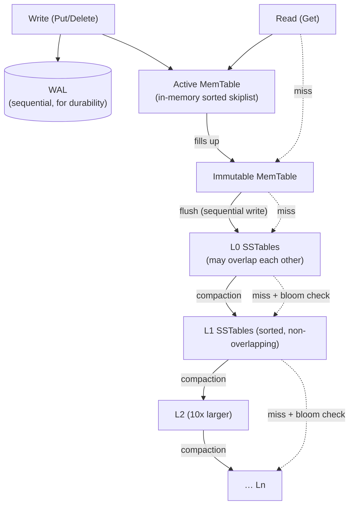

# RocksDB Architecture (LSM-Tree Storage Engine)

> An exploration of how RocksDB uses a **Log-Structured Merge-tree (LSM-tree)** to transform random writes into efficient sequential disk operations. This document explains the roles of the **Write-Ahead Log (WAL)**, **MemTable**, **SSTables**, the **L0–Ln level hierarchy**, **compaction**, and **Bloom filters**, while examining the resulting trade-offs in **write amplification**, **read amplification**, and **space amplification**. Every measurement presented was collected using RocksDB's built-in **`db_bench`** utility (RocksDB 7.8.3), including a controlled comparison demonstrating a **4.5× improvement** in read throughput when Bloom filters are enabled.

---

## Table of Contents

1. [Problem Background](#1-problem-background)
2. [Architecture Overview](#2-architecture-overview)
3. [Internal Design](#3-internal-design)

   * [3.1 Write Path](#31-write-path-memtable--wal)
   * [3.2 SSTables & the Level Hierarchy](#32-sstables--the-l0ln-level-hierarchy)
   * [3.3 Compaction](#33-compaction)
   * [3.4 Read Path & Bloom Filters](#34-read-path--bloom-filters)
4. [Design Trade-Offs](#4-design-trade-offs)

   * [Advantages](#advantages) · [Limitations](#limitations) · [Performance (RUM)](#performance-implications--the-amplification-rum-trade-off) · [LSM vs B-Tree](#lsm-vs-b-tree-rocksdb-vs-innodbpostgresql)
5. [Experiments / Observations](#5-experiments--observations)
6. [Key Learnings](#6-key-learnings)
7. [References](#references)

---

## 1. Problem Background

RocksDB is an **embedded key-value storage engine** derived from Google's LevelDB and later extended by Facebook in 2012. It was designed specifically for environments with **high write throughput** running on modern flash storage, where traditional storage engines can become limited by random disk I/O.

Conventional **B-tree** storage engines modify data directly within existing pages. Under write-intensive workloads, this results in many small **random writes**, which are costly on hard drives and contribute to additional wear on SSDs.

RocksDB approaches the problem differently by adopting an **LSM-tree (Log-Structured Merge-tree)** architecture. Instead of writing changes directly to disk, updates are first accumulated in memory and later flushed as **immutable, sorted SSTables** using large sequential writes. Sequential I/O is significantly more efficient for both throughput and flash-device longevity.

This design, however, introduces a different set of challenges. Multiple versions of the same key may temporarily exist in different locations—for example, the newest value may still reside in memory while older versions remain in several SSTables on disk. Consequently, read operations often need to examine multiple data structures before locating the newest value, and a continuous background process known as **compaction** is required to merge files, remove obsolete entries, and maintain performance.

In essence, RocksDB intentionally sacrifices some read efficiency and additional background work in exchange for extremely fast writes. The experiments presented later in this report quantify these trade-offs directly.

Like SQLite, RocksDB is distributed as a **library** rather than a standalone database server. It serves as the storage engine for systems including **MySQL/MyRocks**, **CockroachDB**, **TiKV**, **Kafka Streams**, **Ceph**, and numerous other large-scale applications.

---

## 2. Architecture Overview



The architecture of RocksDB is centered around separating **fast foreground writes** from **background data organization**.

Whenever an application performs a write (`Put` or `Delete`), the operation is recorded in two places. First, it is appended to the **Write-Ahead Log (WAL)** to guarantee durability in the event of a crash. At the same time, the update is inserted into the active **MemTable**, an in-memory sorted data structure that immediately makes the new value available for queries.

Once the MemTable reaches its configured capacity, it is frozen and becomes an **immutable MemTable** while a new active MemTable begins accepting incoming writes. A background thread then flushes the immutable MemTable to disk as a new **Level 0 (L0) SSTable**, performing the write sequentially rather than through numerous random updates.

From this point onward, RocksDB continuously reorganizes data using **compaction**. SSTables are merged from Level 0 into progressively larger levels (L1, L2, and beyond), where files become increasingly organized and non-overlapping. Each successive level is typically around ten times larger than the previous one, allowing large datasets to be maintained efficiently.

Read operations follow the opposite direction. Because the newest version of a key is always the most relevant, RocksDB searches from the newest structures to the oldest: the active MemTable, immutable MemTables, Level 0 SSTables, and then each lower level until a matching key is found.

To avoid unnecessary disk accesses, RocksDB employs **Bloom filters** for SSTables. Before opening a file, the Bloom filter determines whether the requested key could possibly exist within it. If the filter reports that the key is definitely absent, RocksDB skips reading that SSTable entirely, significantly reducing the cost of negative lookups.

--- 

## 3. Internal Design

### 3.1 Write Path (MemTable + WAL)

Every write operation in RocksDB follows a lightweight sequence designed to keep foreground latency low.

1. **Append the operation to the Write-Ahead Log (WAL).** This sequential log ensures that recent updates can be recovered after a crash, even if they have not yet been written to SSTables.

2. **Insert the record into the active MemTable.** By default, the MemTable is implemented as a sorted skip list, allowing newly written data to be queried immediately while maintaining key order in memory.

Once the active MemTable reaches its configured size limit, it is marked as **immutable**, and a fresh MemTable begins accepting new writes without interruption. A background thread is then responsible for flushing the immutable MemTable to disk as a new **Level 0 SSTable**, writing the data sequentially in a single operation.

An important characteristic of this design is that foreground writes never wait for random disk seeks. They interact only with memory and a sequential log, while expensive disk organization is postponed to background processes. This behavior was reflected in **Experiment 1**, which achieved approximately **58,761 writes per second (56.9 MB/s)** for randomly distributed keys.

Updates and deletions also follow this append-only philosophy. Existing records are never modified in place. Instead, updates create newer versions of a key, while deletions generate **tombstones** that indicate the record should eventually be removed. The outdated versions remain until they are eliminated during compaction. This deferred cleanup is the defining characteristic of a log-structured storage engine.

---

### 3.2 SSTables and the L0–Ln Level Hierarchy

An **SSTable (Sorted String Table)** is an immutable file containing key-value pairs arranged in sorted order. Along with the data itself, each SSTable stores metadata such as a block index and, when enabled, a Bloom filter. Because SSTables are never modified after creation, they can be read safely without locking and written efficiently using sequential I/O.

RocksDB organizes SSTables into multiple storage levels.

* **Level 0 (L0):** Newly flushed SSTables are placed here. Since each file originates from an independent MemTable flush, their key ranges may overlap. Consequently, a read operation may need to examine multiple Level 0 files before finding the newest version of a key.

* **Levels 1 through N (L1–Ln):** Beginning with Level 1, SSTables are organized so that files within the same level have non-overlapping key ranges and remain globally sorted. As a result, a lookup needs to inspect at most one SSTable per level. Each level is typically configured to be around ten times larger than the level immediately above it.

After loading one million keys, **Experiment 1** produced the following level distribution:

```text id="kh7azm"
 Level   Files   Size
  L0      3      182.96 MB     (overlapping)
  L1      2      145.24 MB
  L2      6      439.98 MB
 Sum     11      768.18 MB     (12 .sst files on disk, 710 MB total)
```

This hierarchy demonstrates how recently flushed files gradually move into larger, more organized levels as compaction progresses.

---

### 3.3 Compaction

**Compaction** is one of the most important background processes in RocksDB. Its purpose is to continuously reorganize data by reading SSTables from one level, merging their contents, removing obsolete versions, discarding tombstoned records, and writing the merged output into the next storage level.

This process serves several purposes simultaneously. It maintains the sorted structure required for efficient lookups, limits the number of files that must be searched during reads, and reclaims storage occupied by outdated records. However, these benefits come at the cost of additional CPU usage, disk bandwidth, and write activity.

RocksDB supports multiple compaction strategies.

* **Leveled Compaction (default):** Prioritizes lower read amplification and reduced space amplification by keeping files within each level sorted and non-overlapping. The trade-off is increased write amplification because data is rewritten more frequently.

* **Universal (Tiered) Compaction:** Focuses on minimizing write amplification by merging files less aggressively. While this reduces background rewriting, it generally increases both read amplification and temporary storage overhead.

The impact of compaction was clearly visible in **Experiment 1**. Ingesting approximately **0.96 GB** of user data resulted in **0.89 GB** of flushes, **1.81 GB** of compaction writes, and **1.06 GB** of compaction reads. During this process, RocksDB also eliminated **148,472 obsolete keys** (`compaction.key.drop.new`) by collapsing overwritten versions into a single record.

These measurements illustrate that compaction is not simply maintenance—it is the primary source of write amplification within an LSM-tree.

---

### 3.4 Read Path and Bloom Filters

A point lookup (`Get(key)`) searches RocksDB's data structures from newest to oldest.

The lookup begins with the active MemTable, followed by any immutable MemTables waiting to be flushed. If the key is not found in memory, RocksDB continues searching Level 0 SSTables before proceeding through Levels 1, 2, and beyond. The search terminates as soon as the first matching version of the key is discovered.

Without additional optimization, unsuccessful lookups are particularly expensive because the engine may need to inspect every relevant level before concluding that the key does not exist.

To reduce this overhead, RocksDB associates a **Bloom filter** with each SSTable. A Bloom filter is a compact probabilistic data structure capable of answering the question:

> *"Could this key exist in this SSTable?"*

The filter never produces **false negatives**. If it reports that a key is absent, RocksDB can safely skip reading that SSTable entirely. Although false positives are possible, they only result in an occasional unnecessary file lookup, never an incorrect answer.

The effectiveness of Bloom filters was demonstrated in **Experiment 3**, where approximately **85% of lookups targeted keys that did not exist**.

| `bloom_bits`     |     Read Throughput | Bloom Filter Skips |
| ---------------- | ------------------: | -----------------: |
| **0 (disabled)** |  **94,000 ops/sec** |                  0 |
| **10 (enabled)** | **425,244 ops/sec** |        **166,603** |

Enabling a Bloom filter of roughly **1.25 bytes per key** increased read throughput by approximately **4.5×**. During the benchmark, the filter prevented **166,603 unnecessary SSTable reads**, demonstrating why Bloom filters are considered an essential optimization for LSM-tree storage engines rather than an optional enhancement.

---

## 4. Design Trade-Offs

### Advantages

RocksDB's architecture is optimized around maximizing write performance while maintaining acceptable read efficiency through background organization.

* **High write throughput.** Since foreground writes involve only an in-memory update and a sequential WAL append, expensive random disk seeks are avoided. This allows RocksDB to sustain very high write rates while remaining SSD-friendly. In **Experiment 1**, the median write latency (P50) was only **11 μs**.

* **Immutable, sequential storage.** SSTables are created once and never modified afterward. This append-only design produces sequential disk writes, enables lock-free reads from existing files, and simplifies operations such as replication and backup because immutable files can simply be copied.

* **Highly configurable.** RocksDB exposes numerous tuning parameters—including compaction strategy, Bloom filter size, block size, cache configuration, and compression—that allow the engine to be optimized for different workload characteristics.

* **Strong compression potential.** Since data is stored in sorted, immutable blocks, compression algorithms generally achieve higher compression ratios than they do on frequently updated B-tree pages.

---

### Limitations

The same design decisions that make RocksDB efficient for writes also introduce several trade-offs.

* **Read amplification.** A lookup may need to examine multiple storage structures before locating a key, especially when searching for keys that do not exist. Bloom filters significantly reduce this overhead but cannot eliminate it completely.

* **Write amplification caused by compaction.** As data progresses through the storage levels, it is rewritten multiple times. In the measured workload, approximately **2.8×** more data was written than the user originally inserted, increasing CPU usage, disk I/O, and SSD wear.

* **Compaction management.** Background compaction shares system resources with foreground requests. If compaction cannot keep pace with incoming writes, write stalls and latency spikes may occur.

* **Space amplification and delayed cleanup.** Older record versions and tombstones remain on disk until compaction removes them. Long-lived snapshots or range deletions may extend the lifetime of obsolete data and temporarily increase storage consumption.

* **Low-level storage engine only.** RocksDB does not provide SQL, relational features, or distributed transactions by itself. These capabilities are implemented by systems that embed RocksDB, such as MyRocks, TiKV, and CockroachDB.

---

### Performance Implications — The Amplification (RUM) Trade-off

The behavior of an LSM-tree is largely governed by three forms of amplification described by the **RUM Conjecture**: **Read**, **Update (write)**, and **Memory/space** amplification. Improving one aspect almost always comes at the expense of another.

| Amplification           | Description                                               | Measured Result                                                                                                                         |
| ----------------------- | --------------------------------------------------------- | --------------------------------------------------------------------------------------------------------------------------------------- |
| **Write Amplification** | Physical bytes written compared to logical bytes inserted | Approximately **2.8×** (0.96 GB ingested → 0.89 GB flushes + 1.81 GB compaction writes)                                                 |
| **Read Amplification**  | Additional files or levels accessed during lookups        | Bloom filters improved read throughput by **4.5×** (Experiment 3)                                                                       |
| **Space Amplification** | Disk space consumed relative to live data                 | Around **710 MB** stored for approximately **0.96 GB** of ingested random-key data, with temporary overhead occurring during compaction |

The configuration parameters available in RocksDB allow these amplifications to be balanced according to workload requirements.

For example, **leveled compaction** reduces read and space amplification by maintaining a well-organized level structure, but it increases write amplification because data is rewritten more frequently. **Universal compaction** makes the opposite trade-off by reducing background rewriting while accepting higher read and storage costs.

Similarly, allocating more bits to Bloom filters improves read performance by avoiding unnecessary file accesses, but doing so requires additional memory. There is no configuration that minimizes all three amplifications simultaneously; each workload demands a different balance.

---

### Engineering Decisions

Several fundamental design choices define RocksDB's behavior.

* **Sorting is deferred rather than performed immediately.** Instead of maintaining a globally ordered on-disk structure after every write, RocksDB postpones organization until compaction. This significantly lowers the cost of individual write operations.

* **SSTables are immutable.** Existing files are never modified. Whenever data changes, new SSTables are created while obsolete files are retired later through compaction. This simplifies concurrency control, crash recovery, and file management.

* **Bloom filters are attached to individual SSTables.** A relatively small amount of memory is exchanged for a substantial reduction in unnecessary disk reads, particularly for negative lookups. The **4.5× improvement** observed in Experiment 3 illustrates the effectiveness of this decision.

* **Leveled compaction is the default strategy.** RocksDB favors lower read and space amplification for general-purpose workloads, accepting the additional write amplification required to maintain well-organized storage levels.

---

### LSM vs. B-Tree (RocksDB vs. InnoDB/PostgreSQL)

|                            | RocksDB (LSM-tree)                                                             | InnoDB / PostgreSQL (B-tree)                                              |
| -------------------------- | ------------------------------------------------------------------------------ | ------------------------------------------------------------------------- |
| **Write pattern**          | Sequential writes through WAL and MemTable, followed by SSTable flushes        | Random in-place page modifications                                        |
| **Write throughput**       | Very high because writes avoid random seeks                                    | Generally lower for random-write workloads due to page updates and splits |
| **Read behavior**          | May search multiple storage levels; Bloom filters reduce unnecessary reads     | Single B-tree traversal locates the required data                         |
| **Point lookup latency**   | Slightly higher and more variable because multiple structures may be consulted | More predictable because data resides within a single tree                |
| **Storage usage**          | Temporary overhead from compaction and tombstones                              | More stable overall, though fragmentation and bloat may accumulate        |
| **Background maintenance** | Continuous compaction                                                          | VACUUM (PostgreSQL) or purge (InnoDB)                                     |
| **Range scan efficiency**  | Requires merging results across storage levels                                 | Naturally sequential within the ordered tree                              |

The contrast between the two storage models reflects opposite design priorities.

B-tree engines invest work during every write by maintaining a fully ordered structure at all times, allowing future reads to locate data quickly with minimal overhead. LSM-tree engines reverse this strategy: writes remain inexpensive by postponing organization until compaction, while reads rely on mechanisms such as Bloom filters and leveled storage to offset the resulting amplification.

Consequently, RocksDB is particularly well suited to workloads dominated by frequent writes, where the cost of background compaction is acceptable. Traditional B-tree storage engines remain advantageous when consistent, low-latency reads are the primary requirement.

---

## 5. Experiments / Observations

> **Test environment.** All benchmarks were performed using **RocksDB 7.8.3** and its built-in **`db_bench`** utility (Debian package running in Docker) on a 12th-Generation Intel **Core i5-12450H** processor. Compression was disabled to focus exclusively on LSM-tree behavior, and each value stored was **1000 bytes**. The outputs shown below are taken directly from actual benchmark executions.

---

### Experiment 1 — Write Path and Compaction (`fillrandom`, 1 Million Keys)

```text
fillrandom : 17.017 micros/op  58761 ops/sec  56.9 MB/s  (1,000,000 ops)

** Compaction Stats **
 Level  Files   Size
  L0     3     182.96 MB     (overlapping)
  L1     2     145.24 MB
  L2     6     439.98 MB
 Sum    11     768.18 MB

Flush(GB): cumulative 0.893
Cumulative compaction: 1.81 GB write, 1.06 GB read, 12.3 s
Cumulative writes: 1,000K keys, ingest 0.96 GB
compaction.key.drop.new: 148,472
db.write.micros: P50=11.0us  P99=89.1us
```

**Observation.** The benchmark demonstrates the primary strength of the LSM-tree write path. Foreground writes completed with a median latency of only **11 μs**, since they required only an in-memory insertion together with a sequential WAL append.

The background work tells a different story. Although the workload inserted approximately **0.96 GB** of logical data, RocksDB performed **0.89 GB** of MemTable flushes and **1.81 GB** of additional writes during compaction, resulting in approximately **2.8× write amplification**. During compaction, **148,472 obsolete keys** were eliminated as newer versions replaced older ones.

The resulting **L0 → L1 → L2** organization also matches the expected structure of a leveled LSM-tree, confirming that the benchmark produced the standard storage hierarchy.

---

### Experiment 2 — Read Performance Without Bloom Filters

```text
readrandom : 30.148 micros/op  33168 ops/sec  20.3 MB/s  (126,416 of 200,000 found)
db.get.micros: P50=19.8us  P95=73.2us  P99=153.9us
non.last.level.read.count: 588,455   block.cache.hit: 11,228
```

**Observation.** With Bloom filters disabled, point lookups become both slower and more variable than those of a traditional B-tree.

The median lookup latency measured **19.8 μs**, while the 99th percentile increased to **153.9 μs**. Since nearly **37%** of the requested keys were absent, many lookups were forced to continue searching through multiple storage levels before determining that the key did not exist. These negative lookups represent the worst-case behavior of an LSM-tree and clearly illustrate the effects of read amplification.

---

### Experiment 3 — Bloom Filter Comparison

```text
bloom_bits = 0  (off): readrandom  94,000 ops/sec   bloom.filter.useful = 0
bloom_bits = 10 (on) : readrandom 425,244 ops/sec   bloom.filter.useful = 166,603
                                                     bloom.filter.full.positive = 33,346
```

**Observation.** This experiment isolates the impact of Bloom filters by changing only a single configuration parameter while keeping both the dataset and workload identical. Approximately **85%** of the lookups targeted keys that were not present.

Enabling a Bloom filter increased read throughput from **94,000 operations per second** to **425,244 operations per second**, representing an improvement of roughly **4.5×**.

The benchmark also recorded **166,603 useful Bloom filter checks**, meaning RocksDB was able to skip reading an SSTable because the filter proved the requested key could not be present. The **33,346 full positives** correspond to cases where RocksDB still needed to examine the file because the filter reported that the key might exist. These include legitimate matches along with the small number of expected false positives.

Among all experiments, this provides the clearest evidence of why Bloom filters are a critical optimization for LSM-tree storage engines.

---

### Experiment 4 — On-Disk Layout

```text
/tmp/rdb total: 710 MB
 12 .sst files   +   CURRENT, IDENTITY, LOCK, LOG, MANIFEST-*, OPTIONS-*, *.log (WAL)
```

**Observation.** Rather than storing all data in a single file, RocksDB maintains a directory composed of immutable **`.sst`** files together with several metadata files that describe the current state of the database.

The key metadata files include:

* **`CURRENT`**, which identifies the active MANIFEST.
* **`MANIFEST`**, which records the SSTables that exist and the levels to which they belong.
* **`OPTIONS`**, containing the database configuration.
* **`LOCK`**, preventing multiple processes from opening the database simultaneously.
* **WAL (`.log`) files**, which provide crash recovery for recent writes.

The final database occupied approximately **710 MB** on disk despite ingesting nearly **0.96 GB** of logical data, reflecting the effect of compaction removing overwritten entries before they became permanent.

---

## 6. Key Learnings

1. **The defining idea behind an LSM-tree is delaying expensive work.** Rather than performing random in-place updates, RocksDB records writes in memory and a sequential WAL, leaving data reorganization for background compaction. This explains why write latency remained extremely low (P50 = **11 μs**) during the benchmark.

2. **Compaction is fundamental to the design, not an optional optimization.** Every byte written eventually participates in background merging. In the experiments, ingesting **0.96 GB** of data generated **1.81 GB** of compaction writes, corresponding to roughly **2.8× write amplification**. Compaction continuously rewrites data to preserve the ordered level structure and eliminate obsolete versions.

3. **Bloom filters are essential for efficient reads.** The controlled A/B benchmark demonstrated that enabling Bloom filters increased read throughput by approximately **4.5×**. Their primary value lies in preventing unnecessary SSTable accesses during negative lookups, which are otherwise one of the most expensive operations in an LSM-tree.

4. **Level 0 behaves differently from the remaining levels.** Since Level 0 consists of independent MemTable flushes, its files may overlap in key ranges, requiring multiple files to be examined during a lookup. Beginning with Level 1, SSTables become globally ordered and non-overlapping, allowing each level to contribute at most one candidate file during a search.

5. **Read, write, and space amplification must be balanced.** The RUM trade-off means no configuration can minimize all three simultaneously. Choices such as leveled versus universal compaction or larger versus smaller Bloom filters simply shift the balance toward the workload that matters most.

6. **LSM-trees and B-trees solve the same problem using opposite strategies.** Traditional B-tree engines maintain sorted storage continuously, making writes more expensive while keeping reads straightforward. RocksDB reverses this approach by optimizing writes first and postponing organization until compaction. Understanding this inversion explains nearly every architectural characteristic of an LSM-tree.

---

## References

The following references were used to understand RocksDB's architecture, the LSM-tree design, compaction strategies, and the theoretical foundations behind the performance trade-offs discussed throughout this report.

* RocksDB Wiki — *RocksDB Overview*, *Leveled Compaction*, *MemTable*, *Bloom Filter*, *RocksDB Tuning Guide*, and *Benchmarking Tools (`db_bench`)*:
  [https://github.com/facebook/rocksdb/wiki](https://github.com/facebook/rocksdb/wiki)

* Patrick O'Neil et al., *The Log-Structured Merge-Tree (LSM-Tree)* (1996), the original paper introducing the LSM-tree data structure.

* Athanassoulis et al., *Designing Access Methods: The RUM Conjecture* (EDBT 2016), describing the trade-offs between read, update, and memory/space amplification.

* Burton H. Bloom, *Space/Time Trade-offs in Hash Coding with Allowable Errors* (1970), introducing the Bloom filter data structure.

* LevelDB (the predecessor to RocksDB):
  [https://github.com/google/leveldb](https://github.com/google/leveldb)

---

> **Note:** All benchmark results presented in Section 5 were collected using RocksDB **7.8.3** and the built-in **`db_bench`** benchmarking tool on an Intel **Core i5-12450H** processor. Absolute throughput and latency values will naturally vary with hardware, workload characteristics, value sizes, and database configuration. The focus of this report is the relative behavior of the LSM-tree architecture and the amplification trade-offs it exhibits, rather than the exact benchmark numbers themselves.
